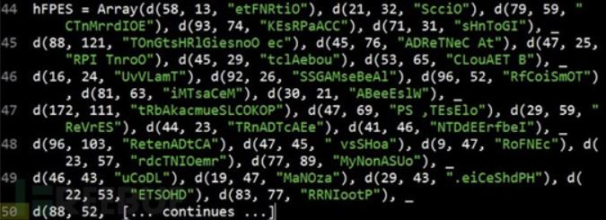

<!-- TOC -->

- [1. 痕迹与指纹检测](#1-痕迹与指纹检测)
    - [1.1. 注册表](#11-注册表)
    - [1.2. 服务](#12-服务)
    - [1.3. 进程](#13-进程)
    - [1.4. 文件夹名称](#14-文件夹名称)
    - [1.5. 虚拟硬件指纹](#15-虚拟硬件指纹)
- [2. 特权指令检测](#2-特权指令检测)
    - [2.1. VirtualPC](#21-virtualpc)
    - [2.2. No Pill（通过禁用VMware加速可以防止No Pill技术的探测）](#22-no-pill通过禁用vmware加速可以防止no-pill技术的探测)
    - [2.3. I/O端口检测](#23-io端口检测)
- [3. 社会工程学检测方法](#3-社会工程学检测方法)
    - [3.1. 检测电脑中常用软件的使用情况](#31-检测电脑中常用软件的使用情况)
    - [3.2. 检测非系统盘的文件数量](#32-检测非系统盘的文件数量)
    - [3.3. 检测恶意软件分析工具](#33-检测恶意软件分析工具)
    - [3.4. 探测安全厂商相关IP地址](#34-探测安全厂商相关ip地址)
- [4. 检测人工操作](#4-检测人工操作)
- [5. 利用虚拟机本身漏洞攻击或者逃逸虚拟机](#5-利用虚拟机本身漏洞攻击或者逃逸虚拟机)
- [6. 其它检测方法与对抗](#6-其它检测方法与对抗)
    - [6.1. 无效操作码](#61-无效操作码)
    - [6.2. 运行时间差](#62-运行时间差)
    - [6.3. 驱动模块](#63-驱动模块)
    - [6.4. 内核设备的符号链接](#64-内核设备的符号链接)
    - [6.5. BIOS检测](#65-bios检测)
- [7. 集成对抗方法](#7-集成对抗方法)
- [8. 实战破解保护壳的虚拟机检测](#8-实战破解保护壳的虚拟机检测)

<!-- /TOC -->
# 1. 痕迹与指纹检测
## 1.1. 注册表
* 项名：HKEY_CLASSES_ROOT\Applications\VMwareHostOpen.exe
* 项名：HKEY_CLASSES_ROOT\Installer\Products\C2A6F2EFE6910124C940B2B12CF170FE\ProductName。键值：VMware Tools
* 项名：HKEY_CLASSES_ROOT\Installer\Products\C2A6F2EFE6910124C940B2B12CF170FE\SourceList\PackageName。键值：VMware Tools.msi（VMware Tools64.msi）
* 项名：HKEY_CURRENT_USER\Printers\DeviceOld。键值：_#VMwareVirtualPrinter,winspool,TPVM:
* 项名：HKEY_LOCAL_MACHINE\HARDWARE\DEVICEMAP\Scsi\Scsi Port 0\Scsi Bus 0\Target Id 0\Logical Unit Id  0\Identifier。键值：VMware Virtual IDE Hard Drive
* 项名：HKEY_LOCAL_MACHINE\HARDWARE\DEVICEMAP\Scsi\Scsi Port 1\Scsi Bus 0\Target Id 0\Logical Unit Id  0\Identifier。键值：NECVMWar VMware IDE CDR10
* 项名：HKEY_LOCAL_MACHINE\SOFTWARE\Classes\Installer\Products\C2A6F2EFE6910124C940B2B12CF170FE\ProductName。键值：VMware Tools
* 项名：HKEY_LOCAL_MACHINE\SOFTWARE\Microsoft\Windows\CurrentVersion\Installer\UserData\S-1-5-18\Products\C2A6F2EFE6910124C940B2B12CF170FE\InstallProperties\DisplayName。键值：VMware Tools
* 项名：HKEY_LOCAL_MACHINE\SOFTWARE\Microsoft\Windows\CurrentVersion\Reinstall\0002\DeviceDesc。键值：VMware SVGA II
* 项名：HKEY_LOCAL_MACHINE\SOFTWARE\Microsoft\Windows NT\CurrentVersion\NetworkCards\2\Description。键值：VMware Accelerated AMD PCNet Adapter
* 项名：HKEY_LOCAL_MACHINE\SOFTWARE\VMware, Inc.\VMware Tools
* 项名：`HKEY_LOCAL_MACHINE\SYSTEM\ControlSet001\Control\Class\{4D36E968-E325-11CE-BFC1-08002BE10318}\0000\DriverDesc`。键值：VMware SVGA II
* 项名：`HKEY_LOCAL_MACHINE\SYSTEM\ControlSet001\Control\Class\{4D36E968-E325-11CE-BFC1-08002BE10318}\0000\ProviderName`。键值：VMware, Inc.
* 项名：`HKEY_LOCAL_MACHINE\SYSTEM\ControlSet001\Control\Class\{4D36E972-E325-11CE-BFC1-08002bE10318}\0001\DriverDesc`。键值：VMware Accelerated AMD PCNet Adapter
* 项名：`HKEY_LOCAL_MACHINE\SYSTEM\ControlSet001\Control\Class\{4D36E97B-E325-11CE-BFC1-08002BE10318}\0000\DriverDesc`。键值：VMware SCSI Controller
* 项名：HKEY_LOCAL_MACHINE\SYSTEM\ControlSet001\Control\Print\Monitors\ThinPrint Print Port Monitor for  VMWare
* 项名：HKEY_LOCAL_MACHINE\SOFTWARE\Oracle\VirtualBox Guest Additions
## 1.2. 服务
* VMware Alias Manager and Ticket Service
* VMware Snapshot Provider
* VMware Tools
* VMware 物理磁盘助手服务
## 1.3. 进程
* VGAuthService.exe
* vmacthlp.exe
* vmtoolsd.exe
* vmware.exe
* VBoxService.exe
## 1.4. 文件夹名称
* C:\Program Files\VMware\VMware Tools\
* C:\Program Files\Oracle\VirtualBox Guest Additions\
## 1.5. 虚拟硬件指纹
* MAC地址
    * VMware：00:05:69、00:0c:29、00:50:56
    * Virtualpc：00:03:ff
    * Virtualbox：08:00:27
* 主板序列号
* 主机型号
* 系统盘所在磁盘名称
* 其他硬件信息

# 2. 特权指令检测
## 2.1. VirtualPC
与VMWare使用一个特殊端口完成主机和客户机间通信的方法类似的是，VirtualPC靠执行非法指令产生一个异常供内核捕获。这个代码如下：
* 0F 3F x1 x2
* 0F C7 C8 y1 y2

由这两个非法指令引起的异常将会被应用程序捕获，然而，如果VirtualPC正在运行，将不会产生异常。X1,x2的允许的数值还不知道，但有一部分已知可以使用，如0A 00,11 00…等等。
```x86asm
__declspec(naked) bool FV_VPC_Exception()
{
  _asm
  {
    push ebp
    mov  ebp, esp
    mov  ecx, offset exception_handler
    push ebx
    push ecx
    push dword ptr fs:[0]
    mov  dword ptr fs:[0], esp
    mov  ebx, 0 // Flag
    mov  eax, 1 // VPC function number
  }

    // call VPC 
   _asm __emit 0Fh
   _asm __emit 3Fh
   _asm __emit 07h
   _asm __emit 0Bh

  _asm
  {
    mov eax, dword ptr ss:[esp]
    mov dword ptr fs:[0], eax
    add esp, 8
    test ebx, ebx
    setz al
    lea esp, dword ptr ss:[ebp-4]
    mov ebx, dword ptr ss:[esp]
    mov ebp, dword ptr ss:[esp+4]
    add esp, 8
    jmp ret1
exception_handler:
    mov ecx, [esp+0Ch]
    mov dword ptr [ecx+0A4h], -1 // EBX = -1 -> not running, ebx = 0 -> running
    add dword ptr [ecx+0B8h], 4 // -> skip past the call to VPC
    xor eax, eax // exception is handled
    ret
ret1:
    ret
  }
}
```
## 2.2. No Pill（通过禁用VMware加速可以防止No Pill技术的探测）
## 2.3. I/O端口检测
# 3. 社会工程学检测方法
## 3.1. 检测电脑中常用软件的使用情况
```vb
Public Function DKTxHE() As Boolean
DKTxHE = RecentFiles.Count < 3
End Function
```
通过Office RecentFiles对象得到系统最近打开过的历史文档数量，如果数量小于3，则认为身处VM环境中。
## 3.2. 检测非系统盘的文件数量
## 3.3. 检测恶意软件分析工具
检测电脑里面是否安装、运行有恶意软件分析工具如ProcessExp、OD、IDAPro等等
## 3.4. 探测安全厂商相关IP地址
通过向https://www.maxmind.com/geoip/v2.1/city/me发出认证请求，设置请求头中的HTTP Refer和User-Agent，访问https://www.maxmind.com/en/locate-my-ip-address来获取宿主系统的地址信息。获取信息封装于JSON格式文件中，包含国家、城市、或者与IP相关的组织机构等信息。如果获取到的组织机构名称与以下JSON文件中的任何机构字符串匹配，恶意软件将发生异常并停止运行。

# 4. 检测人工操作
设置需要人工操作才会触发恶意代码，比如文档缩放的操作、设置下一步按钮、点击关闭时才触发或者滑动条发生位置变化后才触发。
# 5. 利用虚拟机本身漏洞攻击或者逃逸虚拟机
# 6. 其它检测方法与对抗
## 6.1. 无效操作码
## 6.2. 运行时间差
虚拟机中代码运行速度比主机慢
## 6.3. 驱动模块
## 6.4. 内核设备的符号链接
## 6.5. BIOS检测
# 7. 集成对抗方法
当遇到的恶意代码似乎不能运行时，在使用调试或反汇编恶意代码搜索其反虚拟机探测代码之前，应该考虑使用一个卸载了VMware Tools的虚拟机。VMware中有一些未文档化的功能可以帮助减轻反虚拟机技术的探测。将下面的代码放到VMware的.vmx文件中，以减轻虚拟机被探测的可能。
```config
isolation.tools.getPtrLocation.disable = "TRUE"
isolation.tools.setPtrLocation.disable = "TRUE"
isolation.tools.setVersion.disable = "TRUE"
isolation.tools.getVersion.disable = "TRUE"
monitor_control.disable_directexec = "TRUE"
monitor_control.disable_chksimd = "TRUE"
monitor_control.disable_ntreloc = "TRUE"
monitor_control.disable_selfmod = "TRUE"
monitor_control.disable_reloc = "TRUE"
monitor_control.disable_btinout = "TRUE"
monitor_control.disable_btmemspace = "TRUE"
monitor_control.disable_btpriv = "TRUE"
monitor_control.disable_btseg = "TRUE"
```
参数directexec可以使用户模式下的代码被模拟执行而不是直接在硬件上运行，因此它可以挫败一些反虚拟机技术。前四条设置被VMware后门命令使用，它们的作用是使得运行在Guest系统中的VMware Tools不能获取宿主系统的信息。这些设置会禁用VMware Tools的一些有用功能，并可能对虚拟机性能有严重负面影响。所以，仅当其他技术无效时再添加这些选项。当然，也可以将恶意代码在其他虚拟环境或者物理主机上运行。同反调试技术一样，要想发现恶意代码中的反虚拟机技术需要在长期调试过程中积累更多经验。例如，看到一个代码在一个条件跳转处过早终止，这可能就是反虚拟机技术造成的结果。一如既往地警惕这种类型的问题，然后查看其之前的代码，来确定它到底执行了什么操作。和反调试技术一样，通过修改条件跳转指令或者使用NOP指令覆盖来绕过相关探测。
# 8. 实战破解保护壳的虚拟机检测