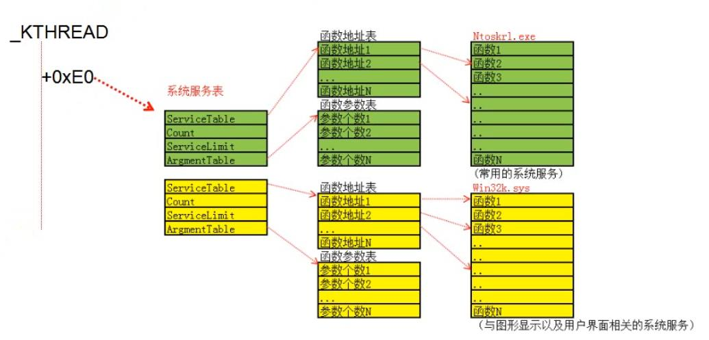

<!-- TOC -->

- [1. API的定义](#1-api的定义)
- [2. API的调用过程-3环部分](#2-api的调用过程-3环部分)
    - [2.1. kernel32.dll!ReadProcessMemory](#21-kernel32dllreadprocessmemory)
    - [2.2. ntdll.dll!NtReadVirtualMemory](#22-ntdlldllntreadvirtualmemory)
    - [2.3. 7FFE0300h地址](#23-7ffe0300h地址)
        - [2.3.1. _KUSER_SHARED_DATA结构体](#231-_kuser_shared_data结构体)
        - [2.3.2. SystemCall-进入0环的通道](#232-systemcall-进入0环的通道)
    - [2.4. 进入0环需要什么？](#24-进入0环需要什么)
        - [2.4.1. 通过中断门进入0环：ntdll.dll!KiIntSystemCall](#241-通过中断门进入0环ntdlldllkiintsystemcall)
        - [2.4.2. 通过快速调用进入0环：ntdll.dll!KiFastSystemCall](#242-通过快速调用进入0环ntdlldllkifastsystemcall)
        - [2.4.3. MSR寄存器](#243-msr寄存器)
            - [2.4.3.1. Windbg读写MSR寄存器](#2431-windbg读写msr寄存器)
            - [2.4.3.2. 汇编指令读写MSR寄存器](#2432-汇编指令读写msr寄存器)
- [3. API的调用过程-0环部分](#3-api的调用过程-0环部分)
    - [3.1. 内核模块文件](#31-内核模块文件)
    - [3.2. 相关结构体](#32-相关结构体)
        - [3.2.1. _KTRAP_FRAME结构体](#321-_ktrap_frame结构体)
        - [3.2.2. _ETHREAD、_KTHREAD结构体](#322-_ethread_kthread结构体)
        - [3.2.3. _KPCR结构体](#323-_kpcr结构体)
    - [3.3. 通过中断门进入0环之后：nt!KiSystemService](#33-通过中断门进入0环之后ntkisystemservice)
    - [3.4. 通过快速调用进入0环之后：nt!KiFastCallEntry](#34-通过快速调用进入0环之后ntkifastcallentry)
- [4. 实践：不通过WindowsAPI调用系统函数](#4-实践不通过windowsapi调用系统函数)
    - [4.1. 实现环境](#41-实现环境)
    - [4.2. 代码](#42-代码)
        - [4.2.1. 通过Call 7FFE0300](#421-通过call-7ffe0300)
        - [4.2.2. 通过中断门](#422-通过中断门)
        - [4.2.3. 通过快速调用](#423-通过快速调用)
    - [4.3. NtProtectVirtualMemory](#43-ntprotectvirtualmemory)
- [5. 系统服务表](#5-系统服务表)
    - [5.1. 概念图](#51-概念图)
        - [5.1.1. 系统服务表位置](#511-系统服务表位置)
        - [5.1.2. 系统服务表成员](#512-系统服务表成员)
        - [5.1.3. 两张系统服务表](#513-两张系统服务表)
    - [5.2. 解析系统调用号->定位系统服务表中的函数](#52-解析系统调用号-定位系统服务表中的函数)
        - [5.2.1. 系统调用号结构](#521-系统调用号结构)
    - [5.3. 修改系统服务表](#53-修改系统服务表)
- [6. 系统服务描述符表（SSDT，System Service Descriptor Table）](#6-系统服务描述符表ssdtsystem-service-descriptor-table)
    - [6.1. 查看SSDT](#61-查看ssdt)

<!-- /TOC -->
# 1. API的定义
Application Programming Interface，应用程序接口，简称API，主要是存放在系统目录C:\Windows\System32下的所有dll，目前大概存在上千个。在Windows上编程，必须要使用WindowsAPI，无法绕开。比如说C函数malloc底层调用的是WindowsAPI中的HeapAlloc。
* Kernel32：内存管理、进程线程
* User32：用户界面相关
* GDI32：画图和显示文本相关
* Ntdll：内核入口（大部分函数都需要进入0环实现功能，3环仅仅是一个接口；只有少部分函数可以完全在3环实现功能）

# 2. API的调用过程-3环部分
## 2.1. kernel32.dll!ReadProcessMemory
分析一下kernel32中的ReadProcessMemory函数
```x86asm
.text:7C8021D0 ; BOOL __stdcall ReadProcessMemory(HANDLE hProcess, LPCVOID lpBaseAddress, LPVOID lpBuffer, DWORD nSize, LPDWORD lpNumberOfBytesRead)
.text:7C8021D0                 public ReadProcessMemory
.text:7C8021D0 ReadProcessMemory proc near             ; CODE XREF: GetProcessVersion+2F12F↓p
.text:7C8021D0                                         ; GetProcessVersion+2F14E↓p ...
.text:7C8021D0
.text:7C8021D0 ProcessHandle   = dword ptr  8
.text:7C8021D0 BaseAddress     = dword ptr  0Ch
.text:7C8021D0 Buffer          = dword ptr  10h
.text:7C8021D0 NumberOfBytesToRead= dword ptr  14h
.text:7C8021D0 lpNumberOfBytesRead= dword ptr  18h
.text:7C8021D0
.text:7C8021D0                 mov     edi, edi
.text:7C8021D2                 push    ebp
.text:7C8021D3                 mov     ebp, esp
.text:7C8021D5                 lea     eax, [ebp+NumberOfBytesToRead]
.text:7C8021D8                 push    eax             ; NumberOfBytesRead
.text:7C8021D9                 push    [ebp+NumberOfBytesToRead] ; NumberOfBytesToRead
.text:7C8021DC                 push    [ebp+Buffer]    ; Buffer
.text:7C8021DF                 push    [ebp+BaseAddress] ; BaseAddress
.text:7C8021E2                 push    [ebp+ProcessHandle] ; ProcessHandle
.text:7C8021E5                 call    ds:NtReadVirtualMemory
.text:7C8021EB                 mov     ecx, [ebp+lpNumberOfBytesRead]
.text:7C8021EE                 test    ecx, ecx
.text:7C8021F0                 jnz     short loc_7C8021FD
.text:7C8021F2
.text:7C8021F2 loc_7C8021F2:                           ; CODE XREF: ReadProcessMemory+32↓j
.text:7C8021F2                 test    eax, eax
.text:7C8021F4                 jl      short loc_7C802204
.text:7C8021F6                 xor     eax, eax
.text:7C8021F8                 inc     eax
.text:7C8021F9
.text:7C8021F9 loc_7C8021F9:                           ; CODE XREF: ReadProcessMemory+3C↓j
.text:7C8021F9                 pop     ebp
.text:7C8021FA                 retn    14h
.text:7C8021FD ; ---------------------------------------------------------------------------
.text:7C8021FD
.text:7C8021FD loc_7C8021FD:                           ; CODE XREF: ReadProcessMemory+20↑j
.text:7C8021FD                 mov     edx, [ebp+NumberOfBytesToRead]
.text:7C802200                 mov     [ecx], edx
.text:7C802202                 jmp     short loc_7C8021F2
.text:7C802204 ; ---------------------------------------------------------------------------
.text:7C802204
.text:7C802204 loc_7C802204:                           ; CODE XREF: ReadProcessMemory+24↑j
.text:7C802204                 push    eax             ; Status
.text:7C802205                 call    SetError
.text:7C80220A                 xor     eax, eax
.text:7C80220C                 jmp     short loc_7C8021F9
.text:7C80220C ReadProcessMemory endp
```
可以看到代码仅仅是压入参数，然后`call ds:NtReadVirtualMemory`，之后设置了一下返回值，所以核心功能应该位于NtReadVirtualMemory中，该函数位于ntdll中
## 2.2. ntdll.dll!NtReadVirtualMemory
```x86asm
.text:7C92D9E0 ZwReadVirtualMemory proc near           ; CODE XREF: LdrFindCreateProcessManifest+1CC↓p
.text:7C92D9E0                                         ; LdrCreateOutOfProcessImage+7C↓p ...
.text:7C92D9E0                 mov     eax, 0BAh       ; NtReadVirtualMemory
.text:7C92D9E5                 mov     edx, 7FFE0300h
.text:7C92D9EA                 call    dword ptr [edx] ; Indirect Call Near Procedure
.text:7C92D9EC                 retn    14h             ; Return Near from Procedure
.text:7C92D9EC ZwReadVirtualMemory endp
```
代码仅仅是设置了一下eax，然后`call dword ptr [7FFE0300h]`，所以核心功能应该位于7FFE0300h地址中，该地址仍然位于ntdll中

## 2.3. 7FFE0300h地址
### 2.3.1. _KUSER_SHARED_DATA结构体
User层和Kernel层分别有一个该结构区域，用于User层和Kernel层分享某些数据，它们使用固定的地址值映射
* User：0x7FFE0000
* Kernel：0xFFDF0000

它们指向同一个物理页，但是在User层只读，在Kernel层可读可写。
### 2.3.2. SystemCall-进入0环的通道
7FFE0300h地址即_KUSER_SHARED_DATA+300h，为SystemCall，3环进入0环的函数的地址。通过eax=1来调用cpuid指令时，处理器的特征信息存放在ecx和edx寄存器中，其中edx包含了一个SEP位（11位），指明了当前CPU是否支持sysenter/sysexit指令（置1代表支持）。
* 不支持：ntdll.dll!KiIntSystemCall()，通过中断门进入0环
* 支持：ntdll.dll!KiFastSystemCall()，通过快速调用进入0环

操作系统会在判断当前CPU是否支持sysenter/sysexit指令后将对应的函数地址放置到_KUSER_SHARED_DATA+300h处。
## 2.4. 进入0环需要什么？
* CS权限变化，需要新的CS
* SS权限变化（和CS保持一致），需要新的SS
* 堆栈切换，需要新的ESP
* 指令切换，需要新的EIP

### 2.4.1. 通过中断门进入0环：ntdll.dll!KiIntSystemCall
```x86asm
.text:7C92E500 KiIntSystemCall proc near  
.text:7C92E500
.text:7C92E500 arg_4           = byte ptr  8
.text:7C92E500
.text:7C92E500                 lea     edx, [esp+arg_4]   ; 参数地址
.text:7C92E504                 int     2Eh                ; API调用的统一中断门
.text:7C92E506                 retn 
.text:7C92E506 KiIntSystemCall endp
```
API调用的统一中断门中断号为0x2E。需要的CS、EIP（EIP对应的0环函数为nt!KiSystemService）位于门描述符中，需要的SS、ESP位于TSS中。
### 2.4.2. 通过快速调用进入0环：ntdll.dll!KiFastSystemCall
```x86asm
.text:7C92E4F0 KiFastSystemCall proc near 
.text:7C92E4F0                 mov     edx, esp  ; 3环栈顶，传递参数
.text:7C92E4F2                 sysenter    ; 通过寄存器传递参数
.text:7C92E4F2 KiFastSystemCall endp
```
但是如果CPU支持sysenter指令，操作系统会在启动的时候提前将CS/SS/ESP/EIP的值存储在MSR寄存器中，这就减去了中断门查找内存所消耗的大量时间，所以叫做快速调用。这里EIP对应的0环函数为nt!KiFastCallEntry。
### 2.4.3. MSR寄存器
|MSR寄存器名称|偏移|
|-|-|
|IA32_SYSENTER_CS|174H|
|IA32_SYSENTER_ESP|175H|
|IA32_SYSENTER_EIP|176H|

SS寄存器的值不在MSR寄存器中，通过计算得到，为CS寄存器的值+8。CPU会在启动的时候填充好MSR寄存器的值。
#### 2.4.3.1. Windbg读写MSR寄存器
```x86asm
rdmsr 174
wrmsr 174 00000000`00000008
```
#### 2.4.3.2. 汇编指令读写MSR寄存器
```x86asm
mov ecx,119h
rdmsr
or eax,00200000h
wrmsr
```
偏移值放置在ECX寄存器中，读写值存储在EDX:EAX寄存器中。
# 3. API的调用过程-0环部分
## 3.1. 内核模块文件
* ntoskrnl.exe（10-10-12分页）
* ntkrnlpa.exe（2-9-9-12分页）

## 3.2. 相关结构体
### 3.2.1. _KTRAP_FRAME结构体
用于保存进入0环时之前的一些寄存器等信息，结构见《内核结构体详解》。
### 3.2.2. _ETHREAD、_KTHREAD结构体
线程、进程相关结构体，结构见《内核结构体详解》。
### 3.2.3. _KPCR结构体
CPU控制区，保存CPU状态，每个CPU有一个该结构体，结构见《内核结构体详解》。
* windbg命令`dd KeNumberProcessors`可以查看CPU数量
* windbg命令`dd KiProcessorBlock`查看kpcr结构体地址，出现了几个有效地址就代表有几个CPU

## 3.3. 通过中断门进入0环之后：nt!KiSystemService
```x86asm
.text:00407631                 push    0           ; 填充_kTrap_Frame + 0x64 -> ErrorCode为0
.text:00407633                 push    ebp         ; 填充_kTrap_Frame中的五个旧寄存器，保存旧寄存器
.text:00407634                 push    ebx         ;
.text:00407635                 push    esi         ;
.text:00407636                 push    edi         ;
.text:00407637                 push    fs          ;
.text:00407639                 mov     ebx, 30h    ; fs=30h，在内核里面，fs指向不再是TEB，而是_kpcr，30段起始地址即为_kpcr
.text:0040763E                 mov     fs, ebx     ;
.text:00407640                 push    dword ptr ds:0FFDFF000h   ; 0FFDFF000h就是30段起始地址，即_kpcr
.text:00407640                                                   ; 压入_kpcr + 0x0 -> NtTib + 0x0 -> ExceptionList即旧异常链
.text:00407640                                                   ; 填充_kTrap_Frame -> ExceptionList
.text:00407646                 mov     dword ptr ds:0FFDFF000h, 0FFFFFFFFh  ; 赋值新的ExceptionList为-1即空白
.text:00407650                 mov     esi, ds:0FFDFF124h        ; _kpcr + 0x124 -> _KPRCB + 0x4 -> CurrentThread(type _KTHREAD)
.text:00407656                 push    dword ptr [esi+140h]      ; 压入_KTHREAD + 0x140 -> PreviousMode填充_kTrap_Frame -> PreviousPreviousMode
.text:0040765C                 sub     esp, 48h                  ; 使得esp指向_kTrap_Frame
.text:0040765F                 mov     ebx, [esp+68h+arg_0]      ; 获取SegCs即旧的CS段的值
.text:00407663                 and     ebx, 1                    ; 检查RPL，3环计算得1，0环计算得0
.text:00407666                 mov     [esi+140h], bl            ; 修改_KTHREAD + 0x140 -> PreviousMode（先前模式，前代码特权级别，3环为1，0环为0）为计算结果
.text:0040766C                 mov     ebp, esp                  ; ebp -> _kTrap_Frame
.text:0040766E                 mov     ebx, [esi+134h]           ; 用_KTHREAD + 0x134 -> TrapFrame填充_kTrap_Frame + 0x3C（临时存储）
.text:00407674                 mov     [ebp+3Ch], ebx            ;
.text:00407677                 mov     [esi+134h], ebp           ; 用_kTrap_Frame地址填充_KTHREAD -> TrapFrame
.text:0040767D                 cld                               ; 清除方向标志
.text:0040767E                 mov     ebx, [ebp+60h]            ; 将旧的ebp移到ebx
.text:00407681                 mov     edi, [ebp+68h]            ; 将旧的eip移到edi
.text:00407684                 mov     [ebp+0Ch], edx            ; edx存储的是参数列表，填充到_kTrap_Frame + 0xC -> DbgArgPointer
.text:00407687                 mov     dword ptr [ebp+8], 0BADB0D00h      ; 填充_kTrap_Frame + 0x8 -> DbgArgMark为0BADB0D00h
.text:0040768E                 mov     [ebp+0], ebx              ; 填充旧的ebp到_kTrap_Frame + 0x0 -> DbgEbp
.text:00407691                 mov     [ebp+4], edi              ; 填充旧的eip到_kTrap_Frame + 0x4 -> DbgEip
.text:00407694                 test    byte ptr [esi+2Ch], 0FFh  ; 检查 _KTHREAD +0x2C -> DebugActive 是否为-1，检查是否位于调试状态
.text:00407694                                                   ; 可以循环修改该位置导致CPU无法检查到调试状态，无法填充调试相关寄存器
.text:00407694                                                   ; 从而破坏调试环境
.text:00407698                 jnz     Dr_kss_a                  ; 不是-1则处于调试状态，则跳转填充调试器
.text:0040769E                 sti                               ; 允许可屏蔽中断
.text:0040769F                 jmp     loc_407781


.text:00407781                 mov     edi, eax        ; edi = callnumber
.text:00407783                 shr     edi, 8          ; edi = callnumber > 8，剩下函数索引高四位和表索引位
.text:00407786                 and     edi, 30h        ; edi = (callnumber > 8) & (0011 0000)；edi = 0（ntoskrnl.exe），0x10 （win32k.sys）
.text:00407789                 mov     ecx, edi        ; ecx = 0（ntoskrnl.exe），0x10 （win32k.sys）
.text:0040778B                 add     edi, [esi+0E0h] ; edi = 0 ：edi = _KTHREAD + 0xE0 -> SystemServiceTable(nt)
.text:0040778B                                         ; edi = 0x10 ：edi = [_KTHREAD + 0xE0] + 0x10 = SystemServiceTable(win32k)
.text:0040778B                                         ; 因为SystemServiceTable有四个成员，大小正好为0x10，edi = 系统服务表地址
.text:00407791                 mov     ebx, eax        ; ebx = callnumber
.text:00407793                 and     eax, 0FFFh      ; eax = callnumber & 0FFF = 函数索引
.text:00407798                 cmp     eax, [edi+8]    ; 比较函数索引和函数表中函数数量
.text:0040779B                 jnb     _KiBBTUnexpectedRange    ; 超出范围，跳转到错误处理
.text:004077A1                 cmp     ecx, 10h            ; 判断是否为win32k.sys表
.text:004077A4                 jnz     short loc_4077C0    ; 不是则跳转
.text:004077A6                 mov     ecx, ds:0FFDFF018h  ; 当表为win32k.sys时才会调用
.text:004077A6                                             ; win32k.sys里面的函数是动态加载的，即调用时才加载
.text:004077A6                                             ; 这里的代码和动态加载相关
.text:004077A6                                             ; _kpcr + 0x18 -> Self，ecx指向_kpcr
.text:004077AC                 xor     ebx, ebx            ; 清空ebx
.text:004077AE                 or      ebx, [ecx+0F70h]    ; _kpcr + 0x120 + 0xE50 -> _KPRCB + 0xB30 -> _PROCESSOR_POWER_STATE + 0x320
.text:004077AE                                             ; = 
.text:004077B4                 jz      short loc_4077C0    
.text:004077B6                 push    edx                 
.text:004077B7                 push    eax                 
.text:004077B8                 call    ds:_KeGdiFlushUserBatch
.text:004077BE                 pop     eax
.text:004077BF                 pop     edx
.text:004077C0
.text:004077C0 loc_4077C0:                             ; CODE XREF: _KiSystemService+173↑j
.text:004077C0                                         ; _KiSystemService+183↑j
.text:004077C0                 inc     dword ptr ds:0FFDFF638h   ; _kpcr + 0x120 + 0x518 -> _KPRCB + 0x518 -> KeSystemCalls 加一
.text:004077C6                 mov     esi, edx                  ; esi = 参数列表
.text:004077C8                 mov     ebx, [edi+0Ch]            ; 系统服务表函数参数表地址
.text:004077CB                 xor     ecx, ecx                  ; 清空ecx
.text:004077CD                 mov     cl, [eax+ebx]             ; cl = [函数索引 + 函数参数表地址] = 函数参数表值
.text:004077D0                 mov     edi, [edi]                ; edi = 函数地址表地址
.text:004077D2                 mov     ebx, [edi+eax*4]          ; ebx = 函数地址
.text:004077D5                 sub     esp, ecx                  ; 开辟等于函数参数表值的栈空间
.text:004077D7                 shr     ecx, 2                    ; 参数总长度/4等于参数DWORD值
.text:004077DA                 mov     edi, esp                  ; edi = 存放新参数的地址
.text:004077DC                 cmp     esi, ds:_MmUserProbeAddress    ; 判断参数列表是否越过用户空间最大地址限制
.text:004077E2                 jnb     loc_407990                     ; 越过则跳转
.text:004077E8
.text:004077E8 loc_4077E8:                             ; CODE XREF: _KiSystemService+363↓j
.text:004077E8                 rep movsd               ; 复制参数
.text:004077EA                 call    ebx             ; 调用函数！
.text:004077EC
.text:004077EC loc_4077EC:                             ; CODE XREF: _KiSystemService+36E↓j
.text:004077EC                 mov     esp, ebp        ; esp指向_kTrap_Frame
.text:004077EE
.text:004077EE loc_4077EE:                             ; CODE XREF: _KiBBTUnexpectedRange+38↑j
.text:004077EE                                         ; _KiBBTUnexpectedRange+43↑j
.text:004077EE                 mov     ecx, ds:0FFDFF124h     ; ecx指向CurrentThread
.text:004077F4                 mov     edx, [ebp+3Ch]         ; 复原之前临时存储的_KTHREAD + 0x134 -> TrapFrame
.text:004077F7                 mov     [ecx+134h], edx
```
## 3.4. 通过快速调用进入0环之后：nt!KiFastCallEntry
详细信息参见Intel白皮书第二卷。
```x86asm
.text:004076F0                 mov     ecx, 23h     ; ecx = 23h
.text:004076F5                 push    30h          ; fs = 30h
.text:004076F7                 pop     fs           ;
.text:004076F9                 mov     ds, ecx      ; ds = 23h
.text:004076FB                 mov     es, ecx      ; es = 23h
.text:004076FD                 mov     ecx, ds:0FFDFF040h   ; 0FFDFF000h就是30段起始地址，即_kpcr，ecx = _kpcr + 0x40 -> TSS(type _KTSS)
.text:00407703                 mov     esp, [ecx+4]         ; esp = _KTSS + 0x4 -> Esp0，切换到0环栈
.text:00407706                 push    23h                  ; 填充_kTrap_Frame -> HardwareSegSs
.text:00407708                 push    edx                  ; edx为旧栈顶，填充_kTrap_Frame -> HardwareEsp
.text:00407709                 pushf                        ; 填充_kTrap_Frame -> EFlags
.text:0040770A
.text:0040770A loc_40770A:                             ; CODE XREF: _KiSystemService+95↑j
.text:0040770A                 push    2                         ; 2最后赋给了eflags
.text:0040770C                 add     edx, 8                    ; edx = edx + 8，edx原来为旧栈顶，+8之后指向参数（跳过两个Call的返回地址）
.text:0040770F                 popf                              ; eflags = 2
.text:00407710                 or      byte ptr [esp+1],2                ; 置_kTrap_Frame -> EFlags -> IF为1(栈内的可以响应可屏蔽中断)
.text:00407715                 push    1Bh                               ; 填充_kTrap_Frame -> SegCs
.text:00407717                 push    dword ptr ds:0FFDF0304h           ; 填充_kTrap_Frame -> Eip
.text:0040771D                 push    0                                 ; 填充_kTrap_Frame -> ErrCode
.text:0040771F                 push    ebp                               ; 填充_kTrap_Frame的四个旧寄存器
.text:00407720                 push    ebx                               ;
.text:00407721                 push    esi                               ;
.text:00407722                 push    edi                               ;
.text:00407723                 mov     ebx, ds:0FFDFF01Ch                ; _kpcr + 0x1C -> SelfPcr，使得ebx指向_kpcr
.text:00407729                 push    3Bh                               ; 填充_kTrap_Frame -> SegFs
.text:0040772B                 mov     esi, [ebx+124h]                   ; _kpcr + 0x120 + 0x4 = _KPRCB + 0x4 -> CurrentThread(type _KTHREAD)
.text:00407731                 push    dword ptr [ebx]           ; 压入_kpcr -> NtTib -> ExceptionList即旧异常链，填充_kTrap_Frame -> ExceptionList
.text:00407733                 mov     dword ptr [ebx], 0FFFFFFFFh       ; 设置新的ExceptionList为-1
.text:00407739                 mov     ebp, [esi+18h]                    ; ebp = _KTHREAD + 0x18 -> InitialStack
.text:0040773C                 push    1                                 ; 填充_kTrap_Frame -> PreviousPreviousMode为1
.text:0040773E                 sub     esp, 48h                          ; esp指向_kTrap_Frame
.text:00407741                 sub     ebp, 29Ch                         ; _KTHREAD + 0x18 -> InitialStack - 29C
.text:00407747                 mov     byte ptr [esi+140h], 1            ; 设置_KTHREAD -> PreviousMode为1
.text:0040774E                 cmp     ebp, esp                          ; 比较esp和ebp
.text:00407750                 jnz     loc_4076C8
.text:00407756                 and     dword ptr [ebp+2Ch], 0
.text:0040775A                 test    byte ptr [esi+2Ch], 0FFh          ; 检查是否处于调试状态
.text:0040775E                 mov     [esi+134h], ebp
```
# 4. 实践：不通过WindowsAPI调用系统函数
## 4.1. 实现环境
* 操作系统：WinXP
* 编译器：VS2013
* 函数：WriteProcessMemory
## 4.2. 代码
### 4.2.1. 通过Call 7FFE0300
```c
#include "stdio.h"
#include "string.h"
#include "windows.h"

typedef NTSTATUS(NTAPI*pfnNtWriteVirtualMemory)(
	HANDLE ProcessHandle,
	PVOID BaseAddress,
	PVOID Buffer,
	ULONG BufferLength,
	PULONG ReturnLength OPTIONAL
	);

pfnNtWriteVirtualMemory NtWriteVirtualMemory = (pfnNtWriteVirtualMemory)GetProcAddress(GetModuleHandle(L"ntdll.dll"), "NtWriteVirtualMemory");

BOOL EnableDebugPrivilege()
{
	HANDLE hToken;
	BOOL fOk = FALSE;
	if (OpenProcessToken(GetCurrentProcess(), TOKEN_ADJUST_PRIVILEGES, &hToken))
	{
		TOKEN_PRIVILEGES tp;
		tp.PrivilegeCount = 1;
		LookupPrivilegeValue(NULL, SE_DEBUG_NAME, &tp.Privileges[0].Luid);
		tp.Privileges[0].Attributes = SE_PRIVILEGE_ENABLED;
		AdjustTokenPrivileges(hToken, FALSE, &tp, sizeof(tp), NULL, NULL);
		fOk = (GetLastError() == ERROR_SUCCESS);
		CloseHandle(hToken);
	}
	return fOk;
}

int main(void)
{
	EnableDebugPrivilege();
	char strw[10];
	char buffer[10] = "hello";
	HANDLE phandle = OpenProcess(PROCESS_ALL_ACCESS, FALSE, GetCurrentProcessId());
	//int re = NtWriteVirtualMemory(phandle, strw, buffer, 10, 0);
	__asm{
		push 0
			push 0xA
			lea eax, buffer
			push eax
			lea eax, strw
			push eax
			push phandle
			push 0                            ; 填补返回地址
			mov eax, 0x115                   ; NtWriteVirtualMemory in WinXP
			mov edx, 7FFE0300h
			call dword ptr[edx]
			add esp, 18h                    ; 平衡堆栈
	};
	printf("%s\n", buffer);
	printf("%s\n", strw);
	return 0;
}
```
### 4.2.2. 通过中断门
替换之前代码的asm部分即可
```x86asm
__asm{
    push 0
    push 0xA
    lea eax,buffer
    push eax
    lea eax, strw
    push eax
    push phandle
    push 0
    mov eax, 0x115              ; NtWriteVirtualMemory in WinXP
    push 0
    lea edx,[esp+8]
    int 2Eh
    add esp, 1Ch
};
```
### 4.2.3. 通过快速调用
目前存在内联汇编无法编译的问题
## 4.3. NtProtectVirtualMemory
此代码所写内存本身为可写内存，如果需要写在原本只读的内存中，需要先调用NtProtectVirtualMemory修改内存页属性为可写，原理和上面相同
```c
NTSYSAPI  NTSTATUS NTAPI NtProtectVirtualMemory(
  IN HANDLE               ProcessHandle,
  IN OUT PVOID            *BaseAddress,
  IN OUT PULONG           NumberOfBytesToProtect,
  IN ULONG                NewAccessProtection,
  OUT PULONG              OldAccessProtection );
```
以上为NtProtectVirtualMemory函数原型，参数分别为进程句柄、存有需要修改的页面地址的内存空间的指针、需要修改的字节大小、新的权限代码、存放旧的权限代码的内存空间指针。函数调用之后，2、3、5三个参数可能会被改变。2会向下对齐到1000的倍数地址（ex：7FFDF150->7FFDF000），3会向上对齐到1000的倍数（ex：3FF->1000），5会存放有旧的权限代码。
# 5. 系统服务表
## 5.1. 概念图

### 5.1.1. 系统服务表位置
系统服务表位于_KTHREAD + 0xE0
### 5.1.2. 系统服务表成员
* ServiceTable：指针，指向函数地址表，表中每个成员占四个字节
* Count：当前系统服务表被调用了多少次
* ServiceLimit：当前系统服务表中函数数量
* ArgmentTable：指针，指向函数参数表（存有函数地址表中对应函数参数的个数，以字节为单位），表中每个成员占一个字节
### 5.1.3. 两张系统服务表
* 内核文件（ntoskrl.exe、ntkrnlpa.exe）导出函数的一部分，为常用的系统服务
* win32k.sys（user32.dll -> gdi32.dll -> win32k.sys）的导出函数的一部分，为与图形显示以及用户界面相关的系统服务

ntoskrl.exe（ntkrnlpa.exe）和win32k.sys其实就是Windows内核的两大构成部分。
## 5.2. 解析系统调用号->定位系统服务表中的函数
### 5.2.1. 系统调用号结构
|比特位|31-13|12|11-0|
|:-:|:-:|:-:|:-:|
|结构|保留|表指示位|索引号|
* 表指示位：1代表函数位于win32k.sys表中，0代表函数位于ntoskrl.exe表中
* 索引号：函数表的索引号
>**注意**：解析系统调用号的对应代码见上文3.3节
## 5.3. 修改系统服务表
可以通过SSDT（见第6节）来找到系统服务表并修改，注意使用2-9-9-12分页，使用10-10-12分页可能会导致蓝屏
# 6. 系统服务描述符表（SSDT，System Service Descriptor Table）
SSDT中共有四个成员，每一个成员都是一个系统服务表，第三、四个成员Windows操作系统并未使用
## 6.1. 查看SSDT
内核文件（ntoskrnl.exe、ntkrnlpa.exe）导出了一个全局变量KeServiceDescriptorTable（直接声明即可使用），使用windbg命令`dd KeServiceDescriptorTable`可以查看SSDT，但是该命令只能看到第一个成员即ntoskrnl.exe表，查看第二个成员即win32k.sys表（未导出全局变量）需要通过windbg命令`dd KeServiceDescriptorTableShadow`