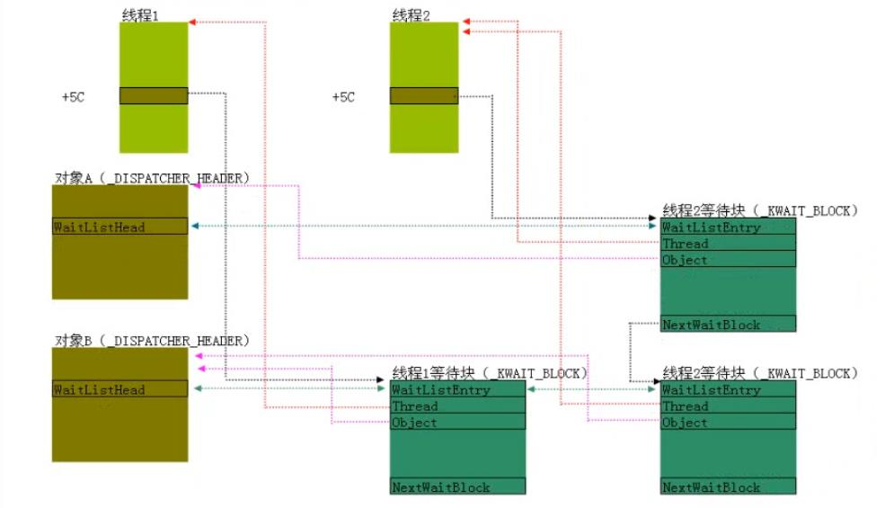

<!-- TOC -->

- [1. 并发与同步](#1-并发与同步)
- [2. 临界区](#2-临界区)
    - [2.1. 并发环境下的代码安全](#21-并发环境下的代码安全)
    - [2.2. 保护代码安全：LOCK前缀](#22-保护代码安全lock前缀)
    - [2.3. 保护多行代码安全：临界区](#23-保护多行代码安全临界区)
        - [2.3.1. 临界区方案：C语言实现方案](#231-临界区方案c语言实现方案)
        - [2.3.2. 临界区方案：汇编实现方案](#232-临界区方案汇编实现方案)
- [3. 自旋锁](#3-自旋锁)
    - [3.1. 不同情况下的内核文件](#31-不同情况下的内核文件)
    - [3.2. 自旋](#32-自旋)
    - [3.3. 自旋锁的特点](#33-自旋锁的特点)
- [4. 线程的等待与唤醒](#4-线程的等待与唤醒)
    - [4.1. 临界区与自旋锁的局限性](#41-临界区与自旋锁的局限性)
    - [4.2. 可等待对象](#42-可等待对象)
    - [4.3. 线程与可等待对象之间的联系：等待网](#43-线程与可等待对象之间的联系等待网)
        - [4.3.1. 等待块](#431-等待块)
        - [4.3.2. 等待网的结构](#432-等待网的结构)
    - [4.4. 等待函数](#44-等待函数)
        - [4.4.1. NtWaitForSingleObject](#441-ntwaitforsingleobject)
        - [4.4.2. KeWaitForSingleObject](#442-kewaitforsingleobject)
            - [4.4.2.1. 等待块所占空间从哪里来](#4421-等待块所占空间从哪里来)
            - [4.4.2.2. 函数流程](#4422-函数流程)
            - [4.4.2.3. 等待循环](#4423-等待循环)
            - [4.4.2.4. 可等待对象相关函数唤醒](#4424-可等待对象相关函数唤醒)
            - [4.4.2.5. 强制唤醒：用户APC唤醒](#4425-强制唤醒用户apc唤醒)
- [5. 可等待对象详细介绍](#5-可等待对象详细介绍)
    - [5.1. 事件：Event](#51-事件event)
        - [5.1.1. 创建函数：CreateEvent](#511-创建函数createevent)
        - [5.1.2. 释放函数：SetEvent](#512-释放函数setevent)
        - [5.1.3. 重置函数：ResetEvent](#513-重置函数resetevent)
        - [5.1.4. 等待循环](#514-等待循环)
            - [5.1.4.1. 激活条件](#5141-激活条件)
            - [5.1.4.2. 修改SingalState](#5142-修改singalstate)
    - [5.2. 信号量：SEMAPHORE](#52-信号量semaphore)
        - [5.2.1. 创建函数：CreateSemaphore](#521-创建函数createsemaphore)
        - [5.2.2. 释放函数：ReleaseSemaphore](#522-释放函数releasesemaphore)
    - [5.3. 互斥体](#53-互斥体)
        - [5.3.1. 创建函数：CreateMutex](#531-创建函数createmutex)
        - [5.3.2. 互斥体的特点](#532-互斥体的特点)
            - [5.3.2.1. 重入临界区](#5321-重入临界区)
            - [5.3.2.2. 解决对象被遗弃问题](#5322-解决对象被遗弃问题)
        - [5.3.3. 释放函数：ReleaseMutex](#533-释放函数releasemutex)
        - [5.3.4. 内核互斥体](#534-内核互斥体)

<!-- /TOC -->
# 1. 并发与同步
* 并发是指多个线程在同时执行
    * 单核（本质上是分时执行，不是真正意义上的同时执行）
    * 多核（在某一时刻，会有多个线程同时执行）
* 同步是指保证在并发执行的环境中，各个线程可以有序的执行（即保证并发代码执行安全）。如果线程中只对局部变量进行操作，由于每个线程拥有自己的堆栈，那么便不会产生同步问题。只有当线程对全局变量进行操作时，才会出现同步问题。
# 2. 临界区
## 2.1. 并发环境下的代码安全
* `dwVal++;`，这种C代码是不安全的
* `INC DWORD PTR DS:[0x12345678]`，这种汇编代码在单核情况下安全，在多核情况下不安全
## 2.2. 保护代码安全：LOCK前缀
`LOCK INC DWORD PTR DS:[0x12345678]`，这种汇编代码是安全的，LOCK前缀会锁住内存，保证同一时刻只能有一个核对该内存进行操作。Windows提供的一些原子操作相关的API就是利用了这个前缀,如InterlockedIncrement、InterlockedDecrement、InterlockedExchange、InterlockedCompareExchange、InterlockedExchangeAdd、InterlockedFlushSList、InterlockedPopEntrySList、InterlockedPushEntrySList，这些函数位于kernel32.dll或者ntdll.dll。但是LOCK指令对于线程需要执行多行汇编代码的情况显得力不从心。
## 2.3. 保护多行代码安全：临界区
临界区是指一次只允许一个线程进入直到离开，实现临界区的方式就是加锁，就是设置一个全局变量，进入加一，出去减一。
### 2.3.1. 临界区方案：C语言实现方案
`if(dwFlag == 0){dwFlag=1;......dwFlag=0;}`，这种实现方案也不安全。
### 2.3.2. 临界区方案：汇编实现方案
```x86asm
Flag = 0
Lab:       ;进入临界区代码
    mov eax,1
    lock xadd [Flag],eax
    cmp eax,0
    jz Fun       ;Flag为0，跳转实现功能代码
    dec [Flag]   ;Flag为1，无法进入临界区，还原Flag，线程进入等待状态
Sleep:
    ;让线程Sleep，进入等待状态
Fun:
    ......
    ret
Leave:     ;离开临界区代码
    lock dec [Flag]
```
以上代码在单核、多核情况下均安全。如果去掉两个lock前缀，则单核安全，多核不安全。
# 3. 自旋锁
## 3.1. 不同情况下的内核文件
Windows启动时，根据CPU核心数为单核、多核的不同，内核文件中的代码也不相同。自旋锁相关的函数，名字里会带有`SpinLock`字样，如KeAcquireSpinLockAtDpcLevel。在多核的内核文件中，这些函数有功能代码即有实际意义，而单核的内核文件中，函数直接返回，没有任何意义。
## 3.2. 自旋
自旋锁在无法上锁的情况下，不会选择让线程休眠（因为线程休眠会导致线程切换，很耗费资源），而是利用`pause`指令让CPU空转一会儿，然后再次尝试上锁，进入循环，所以称作自旋锁。
## 3.3. 自旋锁的特点
* 自旋锁只有在多核条件下才有价值，因为在单核情况下，自旋会使得别的线程得不到执行，自然也不会释放资源，自旋将是一个死循环
* 自旋锁与临界区、事件、互斥体一样，都是一种同步机制，可以让线程处于等待状态，区别在于自旋锁不用切换线程，其他的同步机制都需要切换线程
# 4. 线程的等待与唤醒
## 4.1. 临界区与自旋锁的局限性
* 临界区：Sleep函数的休眠时间长度不好确定
* 自旋锁：自旋锁只有在多核的情况下才有意义，而且只有在等待时间很短的情况下才有意义，如果等待时间较长，CPU空转对资源是种极大的浪费
## 4.2. 可等待对象
在Windows中，一个线程可以通过等待一个或多个可等待对象，从而进入等待状态，另一个线程可以在某些时刻调用可等待对象相关函数（等待对象不同，调用的相关函数也不同）来唤醒等待这些对象的其它线程。等待函数包括WaitForSingleObject、WaitForMultipleObjects、Sleep等，唤醒函数包括SetEvent、ReleaseSemaphore、ReleaseMutant等。可等待对象包括进程（dt_KPROCESS）、线程（dt_KTHREAD）、定时器（dt_KTIMER，Sleep函数对应的可等待对象）、信号量（dt_KSEMAPHORE）、事件（dt_KEVENT）、互斥体（dt_KMUTANT）、文件（dt_FILE_OBJECT）等，可等待对象的结构体都包含有_DISPATCHER_HEADER对象（大部分情况下_DISPATCHER_HEADER为可等待对象的第一个成员），所有包含有_DISPATCHER_HEADER对象的对象，都是可等待对象。
## 4.3. 线程与可等待对象之间的联系：等待网
### 4.3.1. 等待块
等待块即结构体_KWAIT_BLOCK，每个等待块记录了一个线程和一个可等待对象之间的联系。而一个线程可以等待多个可等待对象，一个可等待对象也可以被多个线程等待。这些等待块之间会互相连接，最后形成一个等待网。
### 4.3.2. 等待网的结构

* 线程中的KTHREAD.WaitBlockList指向了等待块列表，这是一个单向循环链表，由_KWAIT_BLOCK.NextWaitBlock链接，链接了该线程等待的所有可等待对象的等待块。
* 可等待对象中的_DISPATCHER_HEADER.WaitListHead作为链表头指向了等待块列表，这是一个双向循环链表，由WaitListEntry链接，链接了所有等待该可等待对象的线程的等待块。
* 以上两个链表加上所有处于等待状态中的线程、所有被等待的可等待对象，形成了一个等待网。在等待网上，可以通过线程找到相关可等待对象，也可以通过可等待对象找到相关线程。
## 4.4. 等待函数
等待函数包括WaitForSingleObject、WaitForMultipleObjects、Sleep等，这里以WaitForSingleObject为例，这个函数会直接调用内核函数NtWaitForSingleObject。
### 4.4.1. NtWaitForSingleObject
函数原型为`NTSTATUS _stdcall NtWaitForSingleObject(HANDLE Handle, BOOLEAN Alertable, PLARGE_INTEGER Timeout)`，这里Handle是3环用户提供的等待对象的句柄；Alertable对应KTHREAD结构体的Alertable属性，如果为1，在插入用户APC时，该线程将被唤醒；Timeout是超时时间。这个函数会调用ObReferenceObjectByHandle来根据3环用户提供的句柄，找到等待对象的内核地址。之后调用KeWaitForSingleObject。
### 4.4.2. KeWaitForSingleObject
#### 4.4.2.1. 等待块所占空间从哪里来
* 为了减少给等待块分配空间的时间开销，Windows在KTHREAD.WaitBlock处预留了四个等待块的空间，其中最后一个专门预留给超时时间的定时器所对应等待块。
* 如果是调用WaitForMultipleObjects来等待大于3个对象的时候，KTHREAD.WaitBlock就不够用了，那么就不再使用KTHREAD.WaitBlock，而是会直接分配所有的空间。
#### 4.4.2.2. 函数流程
* 将KTHREAD.WaitBlock处的第一个等待块赋值
* 如果超时时间不为0，会将KTHREAD.WaitBlock处的最后一个等待块赋值。然后将第一个和最后一个等待块连接起来形成单向循环列表，并让KTHREAD.WaitBlockList指向第一个等待块
* 进入等待循环
#### 4.4.2.3. 等待循环
这里等待循环用伪代码的形式表示。
```c
while(true)   //每次线程被其它线程唤醒，都要进入这个循环
{
    if(符合激活条件)    //1、超时   2、等待对象SingalState>0
    {
        //修改SingalState，这里不同的可等待对象的激活条件判断和修改SingalState不同
        //break跳出循环
    }
    else
    {
        if(第一次执行)
            //将当前线程的等待块挂到等待对象的链表中
        //将线程自己挂上等待链表
        //切换线程
        //......
        //当线程再次获得CPU时，从这里开始执行，这时候是半苏醒状态
    }
}
//线程将自己从等待网上摘下（清零KTHREAD.WaitBlockList）
//释放等待块所占用内存
//线程完全苏醒
```
#### 4.4.2.4. 可等待对象相关函数唤醒
其它线程调用唤醒函数如SetEvent时，这些函数会设置可等待对象的SingalState为1，然后通过等待网找到所有等待该对象的线程，将他们从等待链表上摘下（并不会将线程从等待网上面摘下，所以这些线程只是半苏醒状态）。等待线程获得CPU后，仍然位于WaitForSingleObject的等待循环中，线程会判断自己是否符合激活条件，如果符合则会将自己从等待网上摘下并释放等待块占用内存，这时线程完全苏醒。如果不符合线程则会将自己再次挂上等待链表，进入等待状态。
#### 4.4.2.5. 强制唤醒：用户APC唤醒
向一个等待线程插入用户APC的时候，如果KTHREAD.Alertable=1，当前线程可以被强制唤醒来执行用户APC。但是，在执行完用户APC之后，线程仍然位于WaitForSingleObject的等待循环中，如果不符合激活条件，线程仍然要进入等待状态。
# 5. 可等待对象详细介绍
## 5.1. 事件：Event
### 5.1.1. 创建函数：CreateEvent
```c
HANDLE CreateEventA(
  LPSECURITY_ATTRIBUTES lpEventAttributes,
  BOOL                  bManualReset,    /*TRUE代表事件为通知类型对象（_DISPATCHER_HEADER.Type=0），FALSE代表事件为事件同步对象（1）*/
  BOOL                  bInitialState,   /*初始化时SingalState的值*/
  LPCSTR                lpName
);
```
### 5.1.2. 释放函数：SetEvent
对应内核函数为KeSetEvent，函数步骤如下：
* 把SingalState置1
* 如果事件为通知类型对象，唤醒所有等待该对象的线程
* 如果事件为事件同步对象，从链表头找到第一个等待状态为Any的线程（_KWAIT_BLOCK.WaitType为1）唤醒
### 5.1.3. 重置函数：ResetEvent
* 把SingalState置0
### 5.1.4. 等待循环
#### 5.1.4.1. 激活条件
SingalState>0
#### 5.1.4.2. 修改SingalState
* 如果事件为通知类型对象，不会修改SingalState
* 如果事件为事件同步对象，会将SingalState减去1
## 5.2. 信号量：SEMAPHORE
可以允许指定数量个线程进入临界区
### 5.2.1. 创建函数：CreateSemaphore
```c
HANDLE CreateSemaphoreW(
  LPSECURITY_ATTRIBUTES lpSemaphoreAttributes,
  LONG                  lInitialCount,   /*初始化时KSEMAPHORE.DISPATCHER_HEADER.SingalState的值*/
  LONG                  lMaximumCount,   /*初始化时KSEMAPHORE.Limit的值*/
  LPCWSTR               lpName
);
```
### 5.2.2. 释放函数：ReleaseSemaphore
调用链为NtReleaseSemaphore->KeReleaseSemaphore，会设置SingalState = SingalState + N（参数），然后唤醒所有等待该信号量的线程
## 5.3. 互斥体
### 5.3.1. 创建函数：CreateMutex
函数原型如下：
```c
HANDLE CreateMutexA(
  LPSECURITY_ATTRIBUTES lpMutexAttributes,      /*指向安全属性的指针*/
  BOOL                  bInitialOwner,          /*指示对象是否属于当前线程，初始化互斥对象信号值和所有者*/
  LPCSTR                lpName                  /*指向互斥体对象名称的指针*/
);
```
API调用链为`CreateMutexA--->NtCreateMutant--->KeInitializeMutant`。KeInitializeMutant函数流程如下：
```c
MUTANT.Header.Type = 2;            //互斥体类型为2
MUTANT.Header.SignalState = bInitialOwner?0:1;          //如果属于当前线程，信号值为0，否则为1
MUTANT.OwnerThread = bInitialOwner?当前线程结构体指针:null;  //如果属于当前线程，为当前线程结构体指针，否则为null
MUTANT.Abandoned = 0;
MUTANT.ApcDisable = 0;
if(bInitialOwner){           //如果属于当前线程
    //将当前互斥体挂入到当前线程的互斥体链表
}
```
### 5.3.2. 互斥体的特点
#### 5.3.2.1. 重入临界区
```c
WaitForSingleObject(A)
    ...
    WaitForMultiplesObject(A, B, C)
    //如果使用事件或者信号量，程序会陷入死锁，但是互斥体不会。
```
在WaitForSingleObject函数中，互斥体在两种情况下可以进入临界区，一是信号值为一，二是互斥体属于当前线程（OwnerThread等于CurrentThread），这里的第二种情况决定了互斥体可以重入临界区。互斥体最多可重入临界区0x80000000次。
#### 5.3.2.2. 解决对象被遗弃问题
互斥体、信号量、事件都是内核对象，所以他们都可以进行跨进程的线程同步控制（A进程的X线程和B进程的Y线程使用一个可等待对象Z）。对于信号量和事件来说，若B进程意外终结，会导致Z对象被遗弃，A进程的X线程将永远等待下去。而互斥体不会出现这种情况，进程终结以后，操作系统调用的MmUnloadSystemImage函数会通过Kthread.MutantListHead找到进程的所有线程所拥有的所有互斥体，并调用KeReleaseMutant来释放它们。
### 5.3.3. 释放函数：ReleaseMutex
函数原型为`BOOL WINAPI ReleaseMutex(HANDLE hMutex);`，API调用链为`ReleaseMutex--->NtReleaseMutex--->KeReleaseMutex`。KeReleaseMutex函数流程如下：
```c
if(Abandoned){       //Abandoned为函数的第三个参数，指示了互斥体是否被遗弃。ReleaseMutex调用时该参数为False，MmUnloadSystemImage调用时该参数为True
    MUTANT.Header.SignalState = 1;
    MUTANT.OwnerThread = null;
    MUTANT.Abandoned = 1;
}
else{
    MUTANT.Header.SignalState++;
}
if(MUTANT.Header.SignalState == 1){   //说明其它进程可用该互斥体
    MUTANT.OwnerThread = null;
    //将该互斥体从线程链表中移除
}
```
### 5.3.4. 内核互斥体
用户空间使用CreateMutex函数创建互斥体，而内核使用NtCreateMutex函数来创建互斥体。他们采用同一个数据结构MUNTANT，但是CreateMutex函数会设置ApcDisable为0，而NtCreateMutex函数会设置ApcDisable为1。在KeWaitForSingleObject函数中，互斥体进入临界区前，如果ApcDisable为1，会更改线程结构体来禁用内核APC。