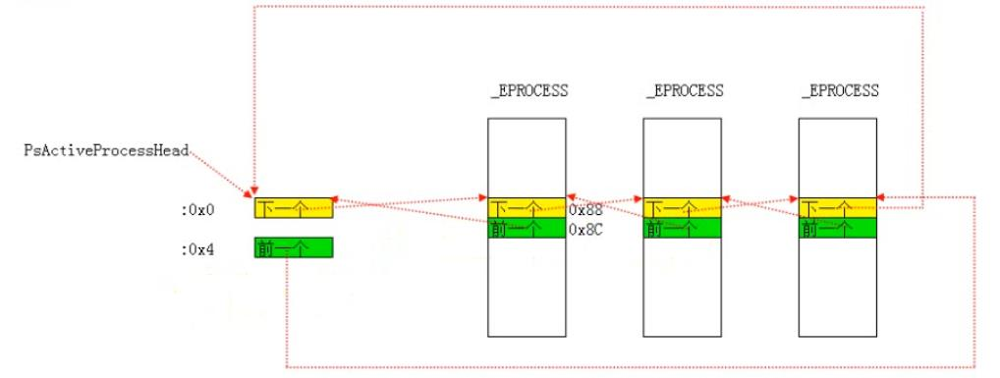
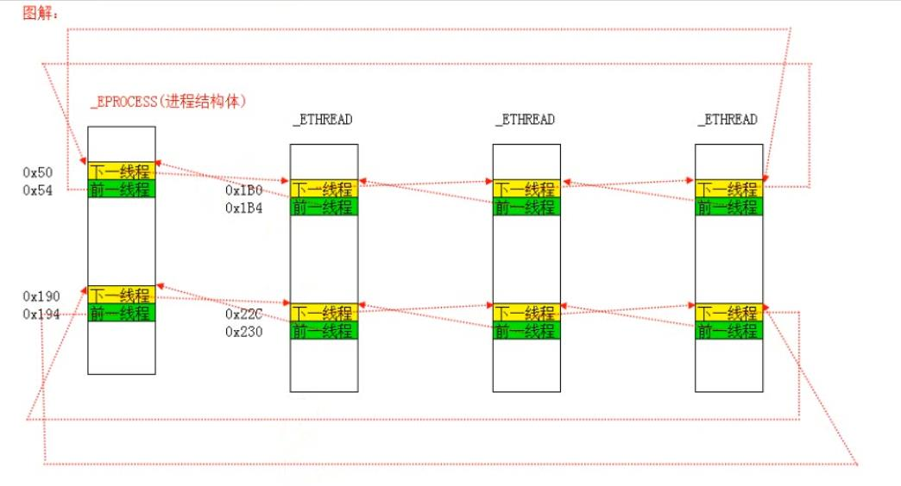

<!-- TOC -->

- [1. 相关结构体](#1-相关结构体)
    - [1.1. 进程相关结构体：_EPROCESS](#11-进程相关结构体_eprocess)
        - [1.1.1. 进程链表示意图](#111-进程链表示意图)
    - [1.2. 线程相关结构体：_ETHREAD](#12-线程相关结构体_ethread)
        - [1.2.1. 连接一个进程所有线程的双向链表示意图](#121-连接一个进程所有线程的双向链表示意图)
    - [1.3. CPU相关结构体：_KPCR](#13-cpu相关结构体_kpcr)
- [2. 等待链表和调度链表](#2-等待链表和调度链表)
    - [2.1. 33个链表：1个等待链表，32个调度链表](#21-33个链表1个等待链表32个调度链表)
    - [2.2. 等待链表](#22-等待链表)
    - [2.3. 调度链表](#23-调度链表)
    - [2.4. 版本差异](#24-版本差异)
- [3. 线程切换](#3-线程切换)
    - [3.1. 线程切换原理](#31-线程切换原理)
        - [3.1.1. 模拟代码](#311-模拟代码)
        - [3.1.2. 线程切换的本质](#312-线程切换的本质)
    - [3.2. 线程切换的时机](#32-线程切换的时机)
        - [3.2.1. 当前线程调用API时的线程切换](#321-当前线程调用api时的线程切换)
        - [3.2.2. 时钟中断时的两种线程切换](#322-时钟中断时的两种线程切换)
            - [3.2.2.1. CPU时间片到期切换](#3221-cpu时间片到期切换)
            - [3.2.2.2. 备用线程切换](#3222-备用线程切换)
        - [3.2.3. 如何一直占据CPU](#323-如何一直占据cpu)
    - [3.3. 线程切换时做了什么](#33-线程切换时做了什么)
        - [3.3.1. 线程的内核堆栈](#331-线程的内核堆栈)
        - [3.3.2. 填充TSS](#332-填充tss)
        - [3.3.3. 修改FS段描述符](#333-修改fs段描述符)
    - [3.4. 找到要运行的线程：调度算法](#34-找到要运行的线程调度算法)
        - [3.4.1. _KiReadySummary](#341-_kireadysummary)
        - [3.4.2. 多核调度](#342-多核调度)
        - [3.4.3. 如果没有就绪线程怎么办：空闲线程](#343-如果没有就绪线程怎么办空闲线程)
- [4. 进程与进程挂靠](#4-进程与进程挂靠)
    - [4.1. 进程与线程的关系](#41-进程与线程的关系)
    - [4.2. _KTHREAD.ApcState.Process和_ETHREAD.ThreadsProcess](#42-_kthreadapcstateprocess和_ethreadthreadsprocess)
    - [4.3. 进程切换的本质](#43-进程切换的本质)
    - [4.4. 进程挂靠](#44-进程挂靠)
    - [4.5. 进程挂靠的步骤](#45-进程挂靠的步骤)
    - [4.6. 跨进程读写内存的步骤](#46-跨进程读写内存的步骤)

<!-- /TOC -->
# 1. 相关结构体
## 1.1. 进程相关结构体：_EPROCESS
每个Windows进程在0环都有一个对应的结构体_EPROCESS，这个结构体包含了进程所有重要的信息。结构体内容见《内核结构体详解》。
### 1.1.1. 进程链表示意图

## 1.2. 线程相关结构体：_ETHREAD
每个Windows线程在0环都有一个对应的结构体_ETHREAD，这个结构体包含了线程所有重要的信息。结构体内容见《内核结构体详解》。
### 1.2.1. 连接一个进程所有线程的双向链表示意图

即使线程断链，线程仍然可以得到执行，因为调度线程不依靠这个链表。
## 1.3. CPU相关结构体：_KPCR
每个CPU在0环都有一个对应的结构体_KPCR，这个结构体包含了CPU本身要用的一些重要数据如GDT、IDT、线程相关信息。结构体内容见《内核结构体详解》。
# 2. 等待链表和调度链表
## 2.1. 33个链表：1个等待链表，32个调度链表
线程有三种状态：等待、就绪、运行。正在运行的线程存储在_KPCR中，就绪和等待线程则存储在另外的33个链表中，1个等待链表，32个就绪链表。这些链表都使用了_KTHREAD的0x060这个偏移，所以一个线程只能同时属于其中一个链表
## 2.2. 等待链表
所有等待状态的线程都存储在这个链表里面，比如说线程调用了Sleep或者WaitForSingleObject等函数时，就挂到这个链表里面。Windbg命令`dd KiWaitListHead`可以查看等待链表头
## 2.3. 调度链表
总共有32个调度链表，分别对应线程优先级0-31，0最低，31最高，默认优先级一般是8，改变优先级就是脱链再挂链的过程。所有处于就绪状态的线程都存储在这些链表里面。Windbg命令`dd KiDispatcherReadyListHead L70`可以查看调度链表头的数组，每个成员长度为8个字节，优先级依次为0-31
## 2.4. 版本差异
* WinXP中，无论有几个CPU，等待链表和调度链表只有一套，也就是1个等待链表+32个调度链表
* Win7中，无论有几个CPU，等待链表和调度链表只有一套，也就是1个等待链表+32个调度链表（64位中是64个调度链表）
* 服务器版本（比如Win2003）中，等待链表整个系统只有一套，但是调度链表是有几个CPU就有几套调度链表
# 3. 线程切换
## 3.1. 线程切换原理
### 3.1.1. 模拟代码
```c
#include "stdio.h"
#include <windows.h>

#define GMTHREADSTACKSIZE 0x80000     //定义线程栈的大小
#define MAXGMTHREAD 100   //支持的最大线程数

//线程信息结构体
typedef struct
{
	char* name;						//线程名
	int Flags;						//线程状态
	int SleepMillsecondDot;			//休眠时间

	void* initialStack;				//线程堆栈起始位置
	void* StackLimit;				//线程堆栈界限
	void* KernelStack;				//线程堆栈当前位置，也就是ESP

	void* lpParameter;				//线程函数的参数
	void(*func)(void* lpParameter);	//线程函数
}GMThread_t;

GMThread_t GMThreadList[MAXGMTHREAD] = { NULL, 0 };   //线程的列表
int CurrentThreadIndex = 0;  //当前线程的索引

//线程状态的标志
enum FLAGS
{
	GMTHREAD_CREATE = 0x1,
	GMTHREAD_READY = 0x2,
	GMTHREAD_SLEEP = 0x4,
	GMTHREAD_EXIT = 0x8,
};

//真正实现线程切换的函数
__declspec(naked) void SwitchContext(GMThread_t* SrcGMThreadp, GMThread_t* DstGMThreadp)
{
	__asm {
		//提升堆栈
		push ebp
			mov ebp, esp
			//保存现场
			push edi
			push esi
			push ebx
			push ecx
			push edx
			push eax
			//esi、edi指向
			mov esi, SrcGMThreadp
			mov edi, DstGMThreadp
			mov[esi + GMThread_t.KernelStack], esp;   把esp保存到kernelstack
			//经典线程切换，另外一个线程复活
			mov esp, [edi + GMThread_t.KernelStack]; 修改esp为目标线程的kernelstack

			pop eax
			pop edx
			pop ecx
			pop ebx
			pop esi
			pop edi
			pop ebp
			ret
	}
}

//调度
void Scheduling(void)
{
	int i;
	int TickCount;
	GMThread_t* SrcGMThreadp;
	GMThread_t* DstGMThreadp;
	TickCount = GetTickCount();     //获取当前tickcount
	SrcGMThreadp = &GMThreadList[CurrentThreadIndex];     //当前线程
	DstGMThreadp = &GMThreadList[0];    //目标线程暂时指向0

	for (i = 1; GMThreadList[i].name; i++) {     //遍历线程
		if (GMThreadList[i].Flags & GMTHREAD_SLEEP) {     //如果是休眠状态的线程
			if (TickCount > GMThreadList[i].SleepMillsecondDot) {       //如果当前tickcount大于唤醒时间，修改状态为就绪
				GMThreadList[i].Flags = GMTHREAD_READY;
			}
		}
		if (GMThreadList[i].Flags & GMTHREAD_READY) {      //如果是就绪状态的线程
			DstGMThreadp = &GMThreadList[i];        //修改目标线程指向就绪状态
			break;
		}
	}

	CurrentThreadIndex = DstGMThreadp - GMThreadList;    //获取目标线程索引（当前-0）
	SwitchContext(SrcGMThreadp, DstGMThreadp);      //切换线程
	return;
}

//启动线程的函数
void GMThreadStartup(GMThread_t* GMThreadp)
{
	GMThreadp->func(GMThreadp->lpParameter);    //调用线程函数，阻塞
	GMThreadp->Flags = GMTHREAD_EXIT;           //标志位修改为退出
	Scheduling();

	return;
}

//空闲线程的函数
void IdleGMThread(void* lpParameter)
{
	printf("IdleGMThread---------------\n");
	Scheduling();
	return;
}

//模拟压栈操作
void PushStack(unsigned int** Stackpp, unsigned int v)
{
	*Stackpp -= 1;
	**Stackpp = v;

	return;
}

//初始化线程
void initGMThread(GMThread_t* GMThreadp, char* name, void(*func)(void* lpParameter), void* lpParameter)
{
	unsigned char* StackPages;
	unsigned int* StackDWordParam;
	GMThreadp->Flags = GMTHREAD_CREATE;    //创建状态
	GMThreadp->name = name;
	GMThreadp->func = func;
	GMThreadp->lpParameter = lpParameter;
	StackPages = (unsigned char*)VirtualAlloc(NULL, GMTHREADSTACKSIZE, MEM_COMMIT, PAGE_READWRITE);   //申请一片栈空间
	ZeroMemory(StackPages, GMTHREADSTACKSIZE);    //初始化栈空间为0
	GMThreadp->initialStack = StackPages + GMTHREADSTACKSIZE;     //获取栈的初始位置
	StackDWordParam = (unsigned int*)GMThreadp->initialStack;     //获取栈指针
	//入栈
	PushStack(&StackDWordParam, (unsigned int)GMThreadp);         //压入结构体指针，充当启动线程的函数GMThreadStartup函数的参数
	PushStack(&StackDWordParam, (unsigned int)0);                 //压入0，充当启动线程的函数GMThreadStartup函数的返回地址
	PushStack(&StackDWordParam, (unsigned int)GMThreadStartup);   //压入启动线程的函数
	PushStack(&StackDWordParam, (unsigned int)5);                 //压入其它寄存器
	PushStack(&StackDWordParam, (unsigned int)7);
	PushStack(&StackDWordParam, (unsigned int)6);
	PushStack(&StackDWordParam, (unsigned int)3);
	PushStack(&StackDWordParam, (unsigned int)2);
	PushStack(&StackDWordParam, (unsigned int)1);
	PushStack(&StackDWordParam, (unsigned int)0);
	//当前线程的栈顶
	GMThreadp->KernelStack = StackDWordParam;
	GMThreadp->Flags = GMTHREAD_READY;          //就绪状态
	return;
}

//注册线程
int RegisterGMThread(char* name, void(*func)(void*lpParameter), void* lpParameter)
{
	int i;
	for (i = 1; GMThreadList[i].name; i++) {       //查找线程列表中是否有同名线程
		if (0 == _stricmp(GMThreadList[i].name, name)) {       //如果有同名线程，则定位到该线程，否则定位到下一个空位
			break;
		}
	}
	initGMThread(&GMThreadList[i], name, func, lpParameter);    //初始化线程

	return (i & 0x55AA0000);
}

//线程函数中调用的函数
void GMSleep(int MilliSeconds)
{
	GMThread_t* GMThreadp;
	GMThreadp = &GMThreadList[CurrentThreadIndex];    //获取当前线程结构体指针
	if (GMThreadp->Flags != 0) {         //处于正常状态
		GMThreadp->Flags = GMTHREAD_SLEEP;           //进入休眠状态
		GMThreadp->SleepMillsecondDot = GetTickCount() + MilliSeconds;      //设置唤醒时间
	}

	Scheduling();    //调度其它线程
	return;
}

void Thread1(void*) {
	while (1){
		printf("Thread11111111111111111111111111111111111111111111111111111\n");
		GMSleep(500);
	}
}
void Thread2(void*) {
	while (1) {
		printf("Thread2222222222222222222222222222222222\n");
		GMSleep(200);
	}
}

void Thread3(void*) {
	while (1) {
		printf("Thread3333333333333333333\n");
		GMSleep(10);
	}
}

void Thread4(void*) {
	while (1) {
		printf("Thread444\n");
		GMSleep(1000);
	}
}


int main()
{
	RegisterGMThread("Thread1", Thread1, NULL);
	RegisterGMThread("Thread2", Thread2, NULL);
	RegisterGMThread("Thread3", Thread3, NULL);
	RegisterGMThread("Thread4", Thread4, NULL);

	while (true) {
		Sleep(5);
		Scheduling();
	}

	return 0;
}
```
### 3.1.2. 线程切换的本质
线程切换的过程本质上就是堆栈切换的过程
## 3.2. 线程切换的时机
### 3.2.1. 当前线程调用API时的线程切换
Windows中的绝大多数API都会调用KiSwapThread->kiSwapContext->SwapContext函数导致线程切换，也就是说，只要调用Windows API，基本就会导致线程切换
### 3.2.2. 时钟中断时的两种线程切换
Windows系列操作系统的时钟中断时间间隔是10-20ms（可以通过函数GetSystemTimeAdjustment来查看）
#### 3.2.2.1. CPU时间片到期切换
当一个新的线程开始执行时，初始化程序会给_KTHREAD.Quantum赋初始值，该值的大小由_KPROCESS.ThreadQuantum决定。每次时钟中断的时候会调用KeUpdateRunTime函数将当前线程的Quantum值减3，如果减到0，则将KPCR.PrcbData.QuantumEnd的值设置为非0。时钟中断的最后，会调用KiDispatchInterrupt函数判断KPCR.PrcbData.QuantumEnd是否为0，如果是则调用KiQuantumEnd来重新设置时间片、找到要运行的线程，之后调用SwapContext来切换线程
#### 3.2.2.2. 备用线程切换
KiDispatchInterrupt函数中即使判断CPU时间片没有到期，如果之后判断当前线程存在备用线程（KPCR.PrcbData.NextThread值不为空），也会调用SwapContext来切换线程
### 3.2.3. 如何一直占据CPU
如果一个线程不调用API，在代码中屏蔽时钟中断（CLI指令或者popfd来设置IF位为0，只能在0环设置），并且确保不会出现异常，那么当前线程将永久占有该CPU。所以抢占式调度是一个错误的说法，线程只能是主动切换即线程主动让出CPU
## 3.3. 线程切换时做了什么
### 3.3.1. 线程的内核堆栈
每个线程都有一个内核堆栈，线程的内核堆栈通过_KTHREAD.InitialStack、_KTHREAD.KernelStack、_KTHREAD.StackLimit来界定。线程的内核堆栈从高地址开始，前0x210个字节存储的是浮点寄存器的值，之后是_Trap_Frame结构体。线程调用API进入0环时，中断门调用通过TSS.ESP0得到0环堆栈，快速调用通过MSR获取一个临时0环堆栈，之后仍然会通过TSS.ESP0获取真正的0环堆栈。
### 3.3.2. 填充TSS
* 切换线程后，会保存当前线程堆栈至TSS.esp0，用于之后线程进入内核的时候获取内核堆栈
* 获取新线程页目录表基址，填充到TSS，并切换至cr3寄存器
* 获取新线程IO权限位图（_KTHREAD.Iopl），填充到TSS->I/O Map Base Address
### 3.3.3. 修改FS段描述符
线程切换的时候，会修改FS段选择子对应的段描述符里面的基地址，从而实现无需修改FS段选择子，但是切换了TEB（切换了线程）
## 3.4. 找到要运行的线程：调度算法
Windows通过函数KiFindReadyThread来找到下一个应该运行的线程，查找方式为按照优先级别从高到低进行查找，找到就停止
### 3.4.1. _KiReadySummary
为了提高查找就绪线程的效率，Windows设计了一个32位变量_KiReadySummary，该变量每个比特位对应一个相应优先级的调度链表。当向某个调度链表中挂入或者摘除线程后，会判断调度链表是否为空（判断KiDispatcherReadyListHead中的双向链表，如果头指针和尾指针相同且等于当前地址，则为空，如果头指针和尾指针相同但是不等于当前地址，则调度链表中存在一个线程），如果是则置该变量对应比特位为0，不是则置1
### 3.4.2. 多核调度
多个CPU时，会随机寻找KiDispatcherReadyListHead指向的数组中的线程，线程可以绑定某个CPU（setThreadAffinityMask）
### 3.4.3. 如果没有就绪线程怎么办：空闲线程
当CPU发现没有就绪线程的时候，会调度空闲线程（_KPCR.PrcbData.IdleThread指向的线程）
# 4. 进程与进程挂靠
## 4.1. 进程与线程的关系
一个进程可以包含多个线程、一个进程至少含有一个线程。进程通过_KPROCESS.DirectoryTableBase为线程提供CR3的值，提供线程所能访问的内存空间
## 4.2. _KTHREAD.ApcState.Process和_ETHREAD.ThreadsProcess
* _ETHREAD.ThreadsProcess的值为创建线程的进程
* _KTHREAD.ApcState.Process指示哪个进程在为线程提供CR3的值，一般情况下，这个值和_ETHREAD.ThreadsProcess相同
## 4.3. 进程切换的本质
线程切换的时候，会比较新旧线程的_KTHREAD.ApcState.Process是否为同一个，如果不是同一个，会切换CR3为新线程所属进程的_KPROCESS.DirectoryTableBase，进程切换的本质就是切换CR3
## 4.4. 进程挂靠
切换CR3，从此该线程读写的均为其它进程的内存空间，称为进程挂靠。进程挂靠使得线程可以突破限制，访问别的进程的内存空间。NtReadVirtualMemory函数在读取其他进程的内存空间的时候，就是采取的进程挂靠的方式（KiAttachProcess函数实现进程挂靠）
## 4.5. 进程挂靠的步骤
* 修改_KTHREAD.ApcState.Process（这一步必须执行，不然一旦产生线程切换，由于在线程切换的时候会依据_KTHREAD.ApcState.Process来修改CR3，所以会出现错误，除非通过屏蔽中断+避免异常+不调用产生线程切换的API的形式来避免线程切换）
* 修改CR3的值
## 4.6. 跨进程读写内存的步骤
* 读内存
	* 切换CR3到目标进程（进程挂靠）
	* 读内存，并保存到高2G地址中的暂存区（高2G中该暂存区对两个进程来说映射相同，这样才能保证在切换CR3回到本进程的时候，实际地址不变，内容不变）
	* 切换CR3回到本进程
	* 将暂存区中的数据复制到缓冲区
* 写内存
	* 将缓冲区中的数据复制到高2G地址中的暂存区
	* 切换CR3到目标进程（进程挂靠）
	* 将暂存区中的数据写入内存
	* 切换CR3回到本进程