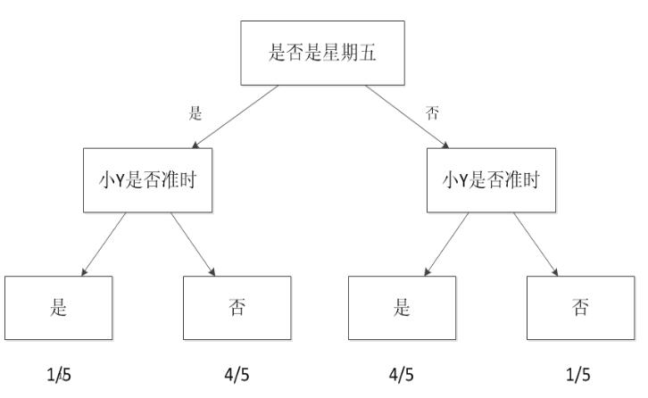
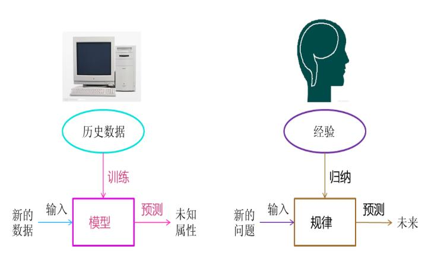

<!-- TOC -->

- [1. 一个故事说明什么是机器学习（Machine Learning）](#1-一个故事说明什么是机器学习machine-learning)
    - [1.1. 计算机工作方式](#11-计算机工作方式)
        - [1.1.1. 传统计算机](#111-传统计算机)
        - [1.1.2. 机器学习](#112-机器学习)
    - [1.2. 一个故事](#12-一个故事)
        - [1.2.1. 预测等人时间](#121-预测等人时间)
        - [1.2.2. 建立模型](#122-建立模型)
        - [1.2.3. 升级模型：增多自变量](#123-升级模型增多自变量)
        - [1.2.4. 再升级模型：从预测离散到预测连续](#124-再升级模型从预测离散到预测连续)
        - [1.2.5. 总结](#125-总结)
- [2. 机器学习的定义](#2-机器学习的定义)
    - [2.1. 一个例子](#21-一个例子)
    - [2.2. 两点注意](#22-两点注意)
- [3. 机器学习的应用范围](#3-机器学习的应用范围)
- [4. 机器学习的方法](#4-机器学习的方法)
- [5. 机器学习的应用--大数据](#5-机器学习的应用--大数据)
- [6. 机器学习的子类--深度学习](#6-机器学习的子类--深度学习)
- [7. 机器学习的父类--人工智能](#7-机器学习的父类--人工智能)
- [8. 机器学习的思考--计算机的潜意识](#8-机器学习的思考--计算机的潜意识)
- [9. 总结](#9-总结)
- [10. 后记](#10-后记)

<!-- /TOC -->
# 1. 一个故事说明什么是机器学习（Machine Learning）
## 1.1. 计算机工作方式
### 1.1.1. 传统计算机
传统上如果我们想让计算机工作，我们给它一串指令，然后它遵照这个指令一步步执行下去。有因有果，非常明确。
### 1.1.2. 机器学习
机器学习是一种让计算机利用数据而不是指令来进行各种工作的方法。统计思想将在你学习机器学习相关理念时无时无刻不伴随，相关而不是因果的概念将是支撑机器学习能够工作的核心概念。
## 1.2. 一个故事
### 1.2.1. 预测等人时间
我和小Y相约见面，但是小Y经常迟到，所以我需要预测一下他会不会迟到，来决定自己是否按时出门。为了成功预测，我回忆了之前和他相约见面时候的情况。假设我跟小Y约过5次，他迟到的次数是1次，那么他按时到的比例为80%，我心中的阈值为70%，我就认为这次小Y应该不会迟到，因此我按时出门。如果小Y在5次迟到的次数中占了4次，也就是他按时到达的比例为20%，由于这个值低于我的阈值70%，因此我选择推迟出门的时间。这个方法可以称为经验法，它利用了以往的数据。依据以往的数据来做出判断这个思想和机器学习的思想根本上是一致的。
### 1.2.2. 建立模型
一般的机器学习模型至少考虑两个量：一个是因变量，也就是我们希望预测的结果，在这个例子里就是小Y迟到与否的判断。另一个是自变量，也就是用来预测小Y是否迟到的量。假设我把时间作为自变量，譬如我发现小Y所有迟到的日子基本都是星期五，而在非星期五情况下他基本不迟到。于是我可以建立一个模型，来模拟小Y迟到与否跟日子是否是星期五的概率，这是最简单的机器学习模型，称之为决策树。

### 1.2.3. 升级模型：增多自变量
自变量只有一个时，模型较为简单。如果把我们的自变量再增多。比如小Y是否是开车过来、天气是否在下雨。就可以建立一个更复杂的模型，这个模型包含三个自变量与一个因变量。
### 1.2.4. 再升级模型：从预测离散到预测连续
如果我希望能够预测小Y迟到的具体时间，我可以把他每次迟到的时间跟雨量的大小以及前面考虑的自变量统一建立一个模型。于是我的模型可以预测值，例如他大概会迟到几分钟。这样可以帮助我更好的规划我出门的时间。在这样的情况下，决策树就无法很好地支撑了，因为决策树只能预测离散值。我们可以用线型回归方法建立这个模型。
### 1.2.5. 总结
如果我自己只负责自变量和因变量的输入，把建立模型以及预测结果的过程交给计算机，这就是机器学习。机器学习与人类思考的经验过程是类似的，不过它能考虑更多的情况，执行更加复杂的计算，解决更灵活负责的问题。
# 2. 机器学习的定义
机器学习方法是计算机利用已有的数据(经验)，归纳统计得出了某种模型(规律)，并利用此模型预测未来(预测)的一种方法。

## 2.1. 一个例子
假如现在我手里有一栋房子需要售卖，我应该给它标上多大的价格？房子的面积是100平方米，价格是100万，120万，还是140万？我现在希望获得一个合理的，并且能够最大程度的反映面积与房价关系的规律。于是我调查了周边与我房型类似的一些房子，获得一组数据。这组数据中包含了大大小小房子的面积与价格，如果我能从这组数据中找出面积与价格的规律，那么我就可以得出房子的价格。对规律的寻找很简单，拟合出一条直线，让它“穿过”所有的点，并且与各个点的距离尽可能的小。通过这条直线，我获得了一个能够最佳反映房价与面积规律的规律。这条直线同时也是一个下式所表明的函数：房价 = 面积 * a + b。上述中的a、b都是直线的参数。获得这些参数以后，我就可以计算出房子的价格。假设a = 0.75,b = 50，则房价 = 100 * 0.75 + 50 = 125万。这个结果与我前面所列的100万，120万，140万都不一样。由于这条直线综合考虑了大部分的情况，因此从“统计”意义上来说，这是一个最合理的预测。
## 2.2. 两点注意
* 房价模型是根据拟合的函数类型决定的。如果是直线，那么拟合出的就是直线方程。如果是其他类型的线，例如抛物线，那么拟合出的就是抛物线方程。机器学习有众多算法，一些强力算法可以拟合出复杂的非线性模型，用来反映一些不是直线所能表达的情况。
* 如果我的数据越多，我的模型就越能够考虑到越多的情况，由此对于新情况的预测效果可能就越好。这是机器学习界“数据为王”思想的一个体现。一般来说(不是绝对)，数据越多，最后机器学习生成的模型预测的效果越好。
# 3. 机器学习的应用范围
* 模式识别
* 统计学习
* 数据挖掘
* 计算机视觉
* 语音识别
* 自然语言处理

# 4. 机器学习的方法
# 5. 机器学习的应用--大数据
# 6. 机器学习的子类--深度学习
# 7. 机器学习的父类--人工智能
# 8. 机器学习的思考--计算机的潜意识
# 9. 总结
# 10. 后记