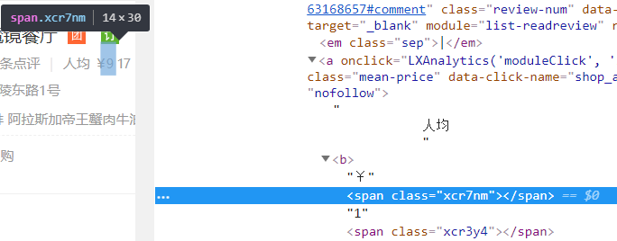
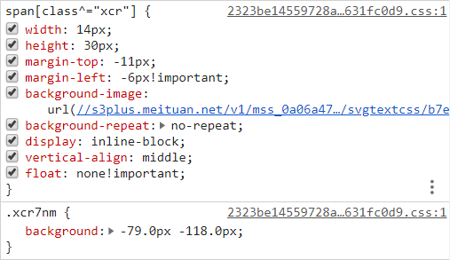

<!-- TOC -->

- [1. span+css（限制窗口大小+背景图+图片偏移）+包含数字的SVG](#1-spancss限制窗口大小背景图图片偏移包含数字的svg)
    - [1.1. 出处](#11-出处)
    - [1.2. 绕过](#12-绕过)

<!-- /TOC -->
# 1. span+css（限制窗口大小+背景图+图片偏移）+包含数字的SVG
利用span标签配上css创建一个仅能容下一个数字的小窗口，将包含大量数字的SVG设置为背景，并通过调整图片相对于窗口的偏移来展示出相应的数字
* 数字对应span标签

* span标签对应的css，css的background-image为一张包含大量数字的SVG

## 1.1. 出处
大众点评网的人均和用户评论等信息
## 1.2. 绕过
获取CSS文件->获取SVG->分析SVG来获取坐标与数字的对照字典->根据span标签的class值定位到CSS->定位坐标->获取值

