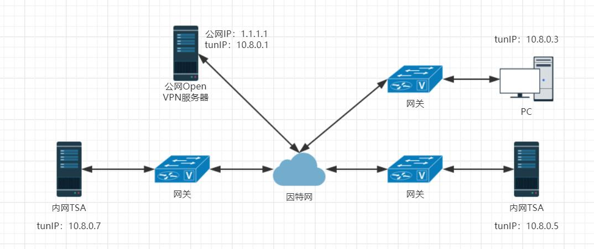

<!-- TOC -->

- [1. 验证是否支持OpenVPN](#1-验证是否支持openvpn)
- [2. 经典网络环境](#2-经典网络环境)
- [3. 服务器端](#3-服务器端)
    - [3.1. easy-rsa](#31-easy-rsa)
        - [3.1.1. 下载（三选一）](#311-下载三选一)
        - [3.1.2. 配置](#312-配置)
        - [3.1.3. 生成CA和服务器端证书](#313-生成ca和服务器端证书)
        - [3.1.4. 生成客户端证书并签名](#314-生成客户端证书并签名)
        - [3.1.5. 整理证书](#315-整理证书)
            - [3.1.5.1. 服务器](#3151-服务器)
            - [3.1.5.2. 客户端](#3152-客户端)
    - [3.2. openvpn](#32-openvpn)
        - [3.2.1. 安装openvpn](#321-安装openvpn)
        - [3.2.2. 配置防火墙](#322-配置防火墙)
        - [3.2.3. 开启公网访问](#323-开启公网访问)
        - [3.2.4. 开启内核转发](#324-开启内核转发)
        - [3.2.5. 设置路由](#325-设置路由)
        - [3.2.6. 启动openvpn](#326-启动openvpn)
        - [3.2.7. openvpn固定客户端地址（可选）](#327-openvpn固定客户端地址可选)
            - [3.2.7.1. 编辑服务器的配置文件](#3271-编辑服务器的配置文件)
            - [3.2.7.2. 创建并编辑IP文件夹](#3272-创建并编辑ip文件夹)
- [4. 客户端连接](#4-客户端连接)
    - [4.1. windows](#41-windows)
        - [4.1.1. 设置局部代理](#411-设置局部代理)
    - [4.2. Linux](#42-linux)
        - [4.2.1. 设置自启动](#421-设置自启动)
- [5. 后期维护](#5-后期维护)

<!-- /TOC -->
# 1. 验证是否支持OpenVPN
```bash
cat /dev/net/tun
# cat:/dev/net/tun:Filedescriptor in bad state（开启了tun/tap，支持）
# cat:/dev/net/tun:Permissiondenied（未开启tun/tap，不支持）
```
# 2. 经典网络环境

# 3. 服务器端
## 3.1. easy-rsa
### 3.1.1. 下载（三选一）
* 下载压缩包：[easy-rsa in Github](https://github.com/OpenVPN/easy-rsa)
* `wget https://github.com/OpenVPN/easy-rsa`
* `git clone https://github.com/OpenVPN/easy-rsa.git`
### 3.1.2. 配置
```bash
unzip easy-rsa-3.0.3.zip  # 解压，可能需要更改版本号
# 拷贝解压出来的easyrsa3为两份，分别用作客户端和服务器
cp -av easy-rsa-3.0.3/easyrsa3 /etc/openvpn/easyrsa3_server
cp -av easy-rsa-3.0.3/easyrsa3 /etc/openvpn/easyrsa3_client
# 编辑拷贝出来的两份vars
vim /etc/openvpn/easyrsa3_server/vars
vim /etc/openvpn/easyrsa3_client/vars
```
vars文件内容如下
```bash
if [ -z "$EASYRSA_CALLER" ]; then
    echo "You appear to be sourcing an Easy-RSA 'vars' file." >&2
    echo "This is no longer necessary and is disallowed. See the section called" >&2
    echo "'How to use this file' near the top comments for more details." >&2
    return 1
fi
set_var EASYRSA    "$PWD"
set_var EASYRSA_PKI        "$EASYRSA/pki"
set_var EASYRSA_DN    "cn_only"
set_var EASYRSA_REQ_COUNTRY     "CN" #国家
set_var EASYRSA_REQ_PROVINCE    "BEIJING" #省份
set_var EASYRSA_REQ_CITY        "BEIJING" #城市
set_var EASYRSA_REQ_ORG         "OpenVPN CERTIFICATE AUTHORITY" #组织
set_var EASYRSA_REQ_EMAIL       "110@openvpn.com" #管理员邮箱
set_var EASYRSA_REQ_OU          "OpenVPN EASY CA" #部门
set_var EASYRSA_KEY_SIZE        2048              #key长度
set_var EASYRSA_ALGO            rsa               #key 类型
set_var EASYRSA_CA_EXPIRE       7000
set_var EASYRSA_CERT_EXPIRE     3650
set_var EASYRSA_NS_SUPPORT      "no"
set_var EASYRSA_NS_COMMENT      "OpenVPN CERTIFICATE AUTHORITY"
set_var EASYRSA_EXT_DIR "$EASYRSA/x509-types"
set_var EASYRSA_SSL_CONF        "$EASYRSA/openssl-1.0.cnf"
set_var EASYRSA_DIGEST          "sha256"
```
### 3.1.3. 生成CA和服务器端证书
```bash
# 切换目录
cd /etc/openvpn/easyrsa3_server
# 初始化，在当前目录创建PKI目录，用于存储一些中间变量及最终生成的证书
./easyrsa init-pki
# 创建根证书，首先会提示设置CA密码（用于CA对之后生成的server和client证书签名），之后设置各种信息，可以直接键入回车默认 
./easyrsa build-ca
# 创建server端证书和private key，nopass表示不加密private key，之后设置各种信息，可以直接键入回车默认 
./easyrsa gen-req wwwserver nopass
# 给server端证书做签名，首先是对一些信息的确认，可以输入yes，然后输入CA密码 
./easyrsa sign server wwwserver  
# 创建Diffie-Hellman，时间会有点长，耐心等待 
./easyrsa gen-dh 
```
### 3.1.4. 生成客户端证书并签名
```bash
# 切换目录
cd /etc/openvpn/easyrsa3_client
# 初始化，在当前目录创建PKI目录，用于存储一些中间变量及最终生成的证书 
./easyrsa init-pki 
# 创建client端证书和private key，nopass表示不加密private key，后设置各种信息，可以直接键入回车默认，hui_client为自定义客户端名称
./easyrsa gen-req hui_client nopass
# 回到服务器的easyrsa3目录，导入client端证书
cd /etc/openvpn/easyrsa3_server
./easyrsa import-req /etc/openvpn/easyrsa3_client/pki/reqs/hui_client.req hui_client
# 给client端证书做签名，首先是对一些信息的确认，可以输入yes，然后输入CA密码
./easyrsa sign client hui_client
```
### 3.1.5. 整理证书
#### 3.1.5.1. 服务器
```bash
mkdir -p /etc/openvpn/server_keys
cp /etc/openvpn/easyrsa3_server/pki/ca.crt /etc/openvpn/server_keys/ \
&& cp /etc/openvpn/easyrsa3_server/pki/private/wwwserver.key /etc/openvpn/server_keys/ \
&& cp /etc/openvpn/easyrsa3_server/pki/issued/wwwserver.crt /etc/openvpn/server_keys/ \
&& cp /etc/openvpn/easyrsa3_server/pki/dh.pem /etc/openvpn/server_keys/
```
#### 3.1.5.2. 客户端
```bash
mkdir /etc/openvpn/client_keys
cp /etc/openvpn/easyrsa3_server/pki/ca.crt /etc/openvpn/client_keys/ \
&& cp /etc/openvpn/easyrsa3_server/pki/issued/hui_client.crt  /etc/openvpn/client_keys/ \
&& cp /etc/openvpn/easyrsa3_client/pki/private/hui_client.key /etc/openvpn/client_keys/
```
## 3.2. openvpn
### 3.2.1. 安装openvpn
```bash
# 安装
yum install epel-release -y
yum install  openssh-server lzo openssl openssl-devel openvpn NetworkManager-openvpn openvpn-auth-ldap -y
# 复制配置文件
cp /usr/share/doc/openvpn-*/sample/sample-config-files/server.conf /etc/openvpn/
# 切换目录
cd /etc/openvpn
# 如果开启tls-auth执行这条命令
openvpn --genkey --secret ta.key
# 编辑服务器端配置文件
vim /etc/openvpn/server.conf
```
服务器端配置文件内容如下
```bash
port 1290      # 端口
proto tcp      # 协议，可以是tcp或者udp，但是需要服务器与客户端保持一致
dev tun
ca /etc/openvpn/server_keys/ca.crt      # 根据情况修改
cert /etc/openvpn/server_keys/wwwserver.crt  # 根据服务端证书修改     
key /etc/openvpn/server_keys/wwwserver.key # 根据服务端密钥修改 
dh /etc/openvpn/server_keys/dh.pem
# tls-auth /etc/openvpn/ta.key 0         # 如果开启tls-auth，解除注释
server 10.8.0.0 255.255.255.0           # 分配的IP段
ifconfig-pool-persist ipp.txt
push "redirect-gateway def1 bypass-dhcp"
push "dhcp-option DNS 8.8.8.8"                      # dns
push "dhcp-option DNS 114.114.114.114"             # dns
keepalive 10 120
cipher AES-256-CBC
comp-lzo
max-clients 50
user openvpn
group openvpn
persist-key
persist-tun
status openvpn-status.log     # 日志文件，相对路径
log-append  openvpn.log     # 日志文件，相对路径
verb 3
mute 20
```
### 3.2.2. 配置防火墙
```
# sample configuration for iptables service
# you can edit this manually or use system-config-firewall
# please do not ask us to add additional ports/services to this default configuration
*filter
:INPUT ACCEPT [0:0]
:FORWARD ACCEPT [0:0]
:OUTPUT ACCEPT [0:0]
-A INPUT -m state --state RELATED,ESTABLISHED -j ACCEPT
-A INPUT -p icmp -j ACCEPT
-A INPUT -i lo -j ACCEPT
-A INPUT -p tcp -m state --state NEW -m tcp --dport 22 -j ACCEPT
-A INPUT -p tcp -m state --state NEW -m tcp --dport 1290 -j ACCEPT
-A INPUT -j REJECT --reject-with icmp-host-prohibited
COMMIT
```
### 3.2.3. 开启公网访问
```bash
iptables -t nat -A POSTROUTING -s 10.8.0.0/255.255.255.0 -o eth0 -j MASQUERADE
service iptables save
```
* MASQUERADE类似于SNAT，不过修改后的地址并非像SNAT一样一开始指定，而是通过网卡动态获取
* -o参数为连接公网的网卡
### 3.2.4. 开启内核转发
编辑 `/etc/sysctl.conf `文件,将`net.ipv4.ip_forward = 0`修改为`net.ipv4.ip_forward = 1`，然后执行`sysctl -p`
### 3.2.5. 设置路由
一般是将10.8.0.0/24路由到tun网卡，其他的路由到对应网卡
### 3.2.6. 启动openvpn
`systemctl start openvpn@server`
### 3.2.7. openvpn固定客户端地址（可选）
客户端的的IP地扯变动和openvpn的版本变动会导致分配的IP地址变动，可能会导致客户端之间无法正常通讯
#### 3.2.7.1. 编辑服务器的配置文件
`vim /etc/openvpn/server.conf`，添加一行`client-config-dir /etc/openvpn/ip`
#### 3.2.7.2. 创建并编辑IP文件夹
`mkdir -p /etc/openvpn/ip`，` vim /etc/openvpn/ip/hui_client`，名称对应客户端名称，内容形如`ifconfig-push 10.8.0.17 10.8.0.18`，ifconfig-push后面跟着的是两个连续的成组IP地址
```bash
[  1,  2] [  5,  6] [  9, 10] [ 13, 14] [ 17, 18]
[ 21, 22] [ 25, 26] [ 29, 30] [ 33, 34] [ 37, 38]
[ 41, 42] [ 45, 46] [ 49, 50] [ 53, 54] [ 57, 58]
[ 61, 62] [ 65, 66] [ 69, 70] [ 73, 74] [ 77, 78]
[ 81, 82] [ 85, 86] [ 89, 90] [ 93, 94] [ 97, 98]
[101,102] [105,106] [109,110] [113,114] [117,118]
[121,122] [125,126] [129,130] [133,134] [137,138]
[141,142] [145,146] [149,150] [153,154] [157,158]
[161,162] [165,166] [169,170] [173,174] [177,178]
[181,182] [185,186] [189,190] [193,194] [197,198]
[201,202] [205,206] [209,210] [213,214] [217,218]
[221,222] [225,226] [229,230] [233,234] [237,238]
[241,242] [245,246] [249,250] [253,254]
```
# 4. 客户端连接
## 4.1. windows
下载[客户端](https://openvpn.net/community-downloads/)并安装，将证书放到C:\Program Files (x86)\OpenVPN\config\目录下，再在该目录下新建一个open.ovpn，内容如下
```bash
client
dev tun
proto tcp    //协议，和服务器保持一致
resolv-retry infinite
nobind
remote 1.1.1.1 1290    //这里填写公网地址和对应端口
ns-cert-type server
comp-lzo
tls-auth ta.key 1      //如果没有开启tls验证需要注释掉
ca ca.crt
cert hui_client.crt    //客户端证书，根据情况修改
key hui_client.key     //客户端密钥，根据情况修改
keepalive 10 120
persist-key
persist-tun
verb 5
redirect-gateway
route-method exe
route-delay 2
status hui-status.log    //日志文件
log-append hui.log       //日志文件
```
保存，启动openvpn客户端即可
### 4.1.1. 设置局部代理
修改配置文件
```bash
#redirect-gateway     # 注释掉该行
route-nopull             # 添加配置行
route 10.8.0.0 255.255.255.0 vpn_gateway  # 添加路由行
#route 10.8.0.0 255.255.255.0 network-gateway   # 路由行的另一种写法
```
## 4.2. Linux
安装openvpn后，复制证书，创建配置文件open.ovpn，直接openvpn open.ovpn即可
### 4.2.1. 设置自启动
`vim /etc/crontab` 添加一行`*/1 * * * * root /etc/openvpn/crond.sh`，代表每分钟执行一次该脚本，脚本内容如下
```bash
#!/bin/bash
# if openvpn not running , then start it.
LOG_PATH=/var/log/crond.log
TIME_NOW=`date "+%Y-%m-%d %H:%M:%S"`
PIDS=`ps -ef |grep "openvpn open.ovpn" |grep -v grep | grep -v crond`
if [ "$PIDS" != "" ]; then
echo "[****INFO*******]$TIME_NOW openvpn is runing!" >> $LOG_PATH
else
echo "[****WARNING****]$TIME_NOW openvpn is stopped, restart it!" >> $LOG_PATH
cd /etc/openvpn/client/ && openvpn open.ovpn &
fi
```
# 5. 后期维护
* openvpn目录下的ipp.txt文件夹存储了客户端名称和相应的地址
* openvpn目录下的easyrsa3_server/pki/index.txt存储了签发的证书，其中包括客户端名称

